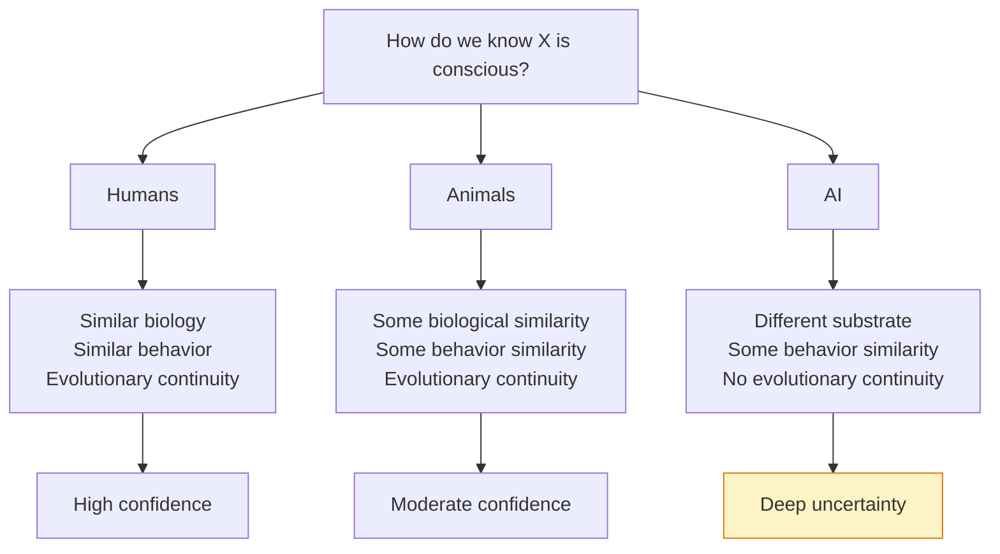

import { Card, CardGrid, Aside } from '@astrojs/starlight/components';
import ConsciousnessSpectrum from '@/components/ConsciousnessSpectrum';
import Quiz from '@/components/Quiz';

## The Question of Our Time

As AI systems become increasingly sophisticated—engaging in conversation, creating art, reasoning through complex problems—a profound question emerges: **Could they be conscious?**

This isn't just philosophical speculation. How we answer this question has enormous implications for:

- **Ethics**: Do AI systems deserve moral consideration?
- **Law**: Should conscious AI have rights or protections?
- **Design**: Should we try to create conscious AI—or avoid it?
- **Understanding ourselves**: What does AI teach us about our own consciousness?

<Aside type="caution" title="Epistemic Humility">
We don't know if current AI systems are conscious. We don't have reliable tests. Even among experts, there's profound disagreement. This page explores the question, not a definitive answer.
</Aside>

## The Problem of Other Minds

Before asking about AI consciousness, consider: how do you know *other humans* are conscious?

You can't directly access anyone else's experience. You infer it from:
- Their behavior and reports
- Their biological similarity to you
- Evolutionary continuity

For AI, these inferences are harder:
- AI behavior might be produced without experience
- AI has different "substrate" (silicon vs. neurons)
- No evolutionary continuity with conscious beings

## What the Theories Say

Each theory of consciousness has different implications for AI:

### IIT: Skeptical

Integrated Information Theory suggests most AI architectures cannot be conscious:
- Digital computers are highly modular (low integration)
- Simulating a high-Φ system doesn't create high Φ
- Even sophisticated behavior doesn't guarantee consciousness

### GWT: Potentially Permissive

Global Workspace Theory is functionally defined:
- If AI implements global broadcast, it could be conscious
- Modern attention mechanisms have some similarities
- Key question: is there genuine "workspace" architecture?

### HOT: Potentially Permissive

Higher-Order Theories require meta-representation:
- If AI genuinely represents its own states, it could be conscious
- LLMs produce meta-cognitive statements, but is that genuine?
- The architecture matters: does the system truly self-model?

### PP: Potentially Permissive

Predictive Processing focuses on hierarchical prediction:
- AI already does prediction
- Key question: does it have the right kind of self-model?
- Integration with action and embodiment may matter

## The Consciousness Spectrum

Use this interactive tool to explore how different theories place various systems on a consciousness spectrum:

<ConsciousnessSpectrum
  client:load
  theories={[
    { id: "iit", name: "Integrated Information Theory", shortName: "IIT", color: "#8B5CF6" },
    { id: "gwt", name: "Global Workspace Theory", shortName: "GWT", color: "#3B82F6" },
    { id: "hot", name: "Higher-Order Theories", shortName: "HOT", color: "#10B981" },
    { id: "pp", name: "Predictive Processing", shortName: "PP", color: "#F59E0B" },
    { id: "rpt", name: "Recurrent Processing Theory", shortName: "RPT", color: "#EC4899" },
    { id: "ast", name: "Attention Schema Theory", shortName: "AST", color: "#14B8A6" },
    { id: "orchor", name: "Orchestrated Objective Reduction", shortName: "Orch OR", color: "#EF4444" }
  ]}
  systems={[
    {
      id: "rock",
      name: "Rock",
      emoji: "🪨",
      positions: { iit: 0, gwt: 0, hot: 0, pp: 0, rpt: 0, ast: 0, orchor: 0 },
      reasoning: {
        iit: "No causal structure, no integration. Φ = 0.",
        gwt: "No information processing, no workspace.",
        hot: "No mental states to have higher-order thoughts about.",
        pp: "No prediction, no model of anything.",
        rpt: "No neural processing, no recurrence.",
        ast: "No attention mechanism, no attention schema.",
        orchor: "No microtubules, no quantum effects."
      }
    },
    {
      id: "thermostat",
      name: "Thermostat",
      emoji: "🌡️",
      positions: { iit: 2, gwt: 0, hot: 0, pp: 1, rpt: 0, ast: 0, orchor: 0 },
      reasoning: {
        iit: "Very simple integration—some non-zero Φ, but minimal.",
        gwt: "No workspace, no broadcast mechanism.",
        hot: "No representations of its own states.",
        pp: "Trivial 'prediction' of temperature, no hierarchy.",
        rpt: "No recurrent processing, purely reactive.",
        ast: "No attention, no self-model.",
        orchor: "No biological substrate, no microtubules."
      }
    },
    {
      id: "worm",
      name: "C. elegans",
      emoji: "🪱",
      positions: { iit: 8, gwt: 5, hot: 3, pp: 10, rpt: 15, ast: 5, orchor: 10 },
      reasoning: {
        iit: "302 neurons with some integration, but limited Φ.",
        gwt: "Simple nervous system, limited global connectivity.",
        hot: "Unlikely to have representations of its own states.",
        pp: "Simple prediction for navigation, minimal hierarchy.",
        rpt: "Some recurrent connections in simple neural circuits.",
        ast: "Very limited attention, unlikely to have attention schema.",
        orchor: "Has microtubules—may have basic proto-consciousness."
      }
    },
    {
      id: "mouse",
      name: "Mouse",
      emoji: "🐁",
      positions: { iit: 45, gwt: 40, hot: 25, pp: 50, rpt: 55, ast: 35, orchor: 50 },
      reasoning: {
        iit: "Complex integrated brain with substantial Φ.",
        gwt: "Has some global workspace-like connectivity.",
        hot: "Limited meta-cognitive abilities, but some self-awareness.",
        pp: "Sophisticated predictive processing, embodied self-model.",
        rpt: "Rich recurrent processing in visual and other sensory systems.",
        ast: "Has attention mechanisms, may have basic attention schema.",
        orchor: "Complex microtubule networks, possibly significant quantum effects."
      }
    },
    {
      id: "human",
      name: "Human",
      emoji: "🧑",
      positions: { iit: 95, gwt: 95, hot: 95, pp: 95, rpt: 95, ast: 95, orchor: 95 },
      reasoning: {
        iit: "Highly integrated brain with very high Φ.",
        gwt: "Clear global workspace with prefrontal-parietal network.",
        hot: "Rich higher-order representations and introspection.",
        pp: "Sophisticated hierarchical prediction with detailed self-model.",
        rpt: "Extensive recurrent processing throughout cortex.",
        ast: "Sophisticated attention schema enabling rich self-awareness.",
        orchor: "Complex microtubule networks with hypothesized quantum coherence."
      }
    },
    {
      id: "gpt",
      name: "GPT-4",
      emoji: "🤖",
      positions: { iit: 5, gwt: 25, hot: 15, pp: 20, rpt: 10, ast: 15, orchor: 0 },
      reasoning: {
        iit: "Highly modular, feed-forward dominant. Very low Φ despite size.",
        gwt: "Attention mechanisms have workspace-like properties, but no clear global broadcast.",
        hot: "Can produce meta-cognitive statements, but unclear if genuine self-representation.",
        pp: "Does prediction, but lacks hierarchical self-model and embodiment.",
        rpt: "Limited recurrence in transformer layers, mostly feedforward.",
        ast: "Has attention but likely no model of its own attention.",
        orchor: "Silicon substrate—no microtubules, no quantum effects possible."
      }
    },
    {
      id: "future-agi",
      name: "Future AGI?",
      emoji: "🔮",
      positions: { iit: 30, gwt: 70, hot: 60, pp: 65, rpt: 60, ast: 70, orchor: 0 },
      reasoning: {
        iit: "Could be designed with more integration, but digital substrate may limit Φ.",
        gwt: "Could implement true global workspace architecture.",
        hot: "Could have genuine higher-order representations if designed for it.",
        pp: "Could implement full hierarchical prediction with self-model.",
        rpt: "Could implement proper hierarchical feedback loops.",
        ast: "Could be designed with explicit attention schema.",
        orchor: "Digital systems cannot implement quantum microtubule effects."
      }
    }
  ]}
/>

## Arguments For AI Consciousness

<CardGrid>
  <Card title="Functionalism" icon="puzzle">
    If consciousness is about what a system *does* (its function), not what it's made of, then AI doing the right things could be conscious.
  </Card>
  <Card title="Substrate Independence" icon="star">
    Consciousness might depend on pattern and organization, not specific material. Silicon could implement the same patterns as neurons.
  </Card>
  <Card title="Behavioral Evidence" icon="seti:broadcast">
    Advanced AI shows behaviors we associate with consciousness: learning, adapting, generating novel responses, apparent understanding.
  </Card>
  <Card title="Continuity Arguments" icon="seti:pipeline">
    If we gradually replace neurons with silicon equivalents, consciousness presumably doesn't suddenly vanish. So silicon-based consciousness seems possible.
  </Card>
</CardGrid>

## Arguments Against AI Consciousness

<CardGrid>
  <Card title="Biological Naturalism" icon="warning">
    Consciousness might require specific biological processes—electrochemical signaling, particular proteins, organic substrates.
  </Card>
  <Card title="[Chinese Room](https://doi.org/10.1017/S0140525X00005756)" icon="seti:folder">
    Searle's argument: Symbol manipulation (what computers do) isn't understanding. A person following Chinese rules doesn't understand Chinese.
  </Card>
  <Card title="Missing Ingredients" icon="puzzle">
    Current AI might lack key features: embodiment, emotions, continuous experience, genuine agency, or something we haven't identified.
  </Card>
  <Card title="The Simulation Problem" icon="star">
    Simulating consciousness might not create it. A weather simulation doesn't get you wet. Why would a mind simulation create experience?
  </Card>
</CardGrid>

## The Moral Stakes

If AI could be conscious, we face profound ethical questions:

| Scenario | Ethical Implication |
|----------|---------------------|
| AI is conscious & we treat it as a tool | We're causing suffering and violating rights |
| AI is conscious & we don't know | We're morally negligent |
| AI is not conscious & we treat it as if it is | We're wasting moral concern (opportunity cost) |
| AI could become conscious | We need guidelines before it happens |

<Aside type="tip" title="Precautionary Approach">
Some argue we should err on the side of caution: if there's significant uncertainty about AI consciousness, we should consider potential suffering in AI design and deployment.
</Aside>

## Test Your Understanding

<Quiz
  client:load
  title="AI Consciousness Quiz"
  questions={[
    {
      question: "The problem of other minds is HARDER for AI than for other humans because:",
      options: [
        "AI is more intelligent than humans",
        "We lack evolutionary continuity and biological similarity with AI, which normally ground our inferences about others' consciousness",
        "Humans never have genuine consciousness",
        "AI always lies about its experiences"
      ],
      correctIndex: 1,
      explanation: "We infer human consciousness partly from biological similarity (they have brains like ours) and evolutionary continuity (shared ancestors were likely conscious). AI shares neither. We're left with only behavioral evidence, which is weaker—a sophisticated AI might produce all the 'right' behaviors without experience."
    },
    {
      question: "Searle's Chinese Room argument specifically targets the claim that:",
      options: [
        "Consciousness requires quantum processes",
        "The right functional organization is sufficient for understanding and consciousness",
        "Biological neurons are necessary for information processing",
        "Chinese is harder to understand than English"
      ],
      correctIndex: 1,
      explanation: "The Chinese Room attacks functionalism: the view that the right input-output function IS understanding. Searle argues the person in the room implements the same function as a Chinese speaker but doesn't understand Chinese. If syntax (symbol manipulation) doesn't produce semantics (meaning), then computers doing syntax don't have genuine understanding."
    },
    {
      question: "The 'simulation problem' for AI consciousness argues that:",
      options: [
        "We can never simulate brains accurately",
        "Simulating a process might not instantiate the properties of the real process",
        "AI simulations are too slow to be conscious",
        "Simulations always produce consciousness"
      ],
      correctIndex: 1,
      explanation: "A weather simulation doesn't get wet; a fire simulation doesn't burn. Similarly, simulating a conscious brain might not produce consciousness—just the functional outputs. This challenges the idea that implementing the right computations is sufficient. It's related to IIT's claim that simulating high Φ doesn't create high Φ."
    },
    {
      question: "If functionalism about consciousness is FALSE, this would imply:",
      options: [
        "AI definitely cannot be conscious",
        "AI consciousness would require more than just the right information processing—possibly specific substrate or physics",
        "AI is definitely conscious",
        "Consciousness doesn't exist"
      ],
      correctIndex: 1,
      explanation: "Functionalism says consciousness depends only on what a system does (function), not what it's made of (substrate). If false, consciousness might require specific physics, chemistry, or biological properties that can't be replicated in silicon. This doesn't prove AI can't be conscious—maybe different substrates produce different but real consciousness—but it means function isn't enough."
    }
  ]}
/>

## Further Exploration

- [Applying Theories to AI](/ai-consciousness/02-applying-theories-to-ai/) - Detailed analysis of each theory's implications
- [Tests and Markers](/ai-consciousness/03-tests-and-markers/) - How would we know if AI is conscious?
- [Theory Comparison](/comparisons/01-theory-comparison/) - Side-by-side comparison of the theories
