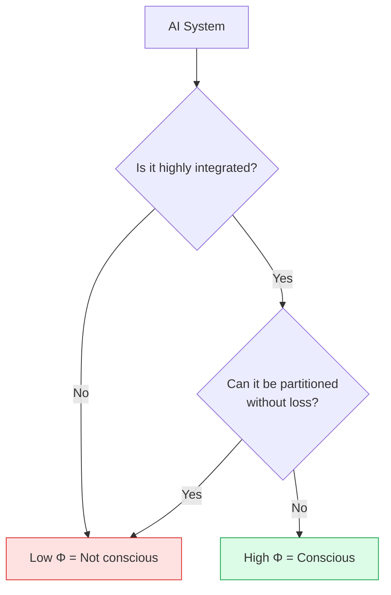
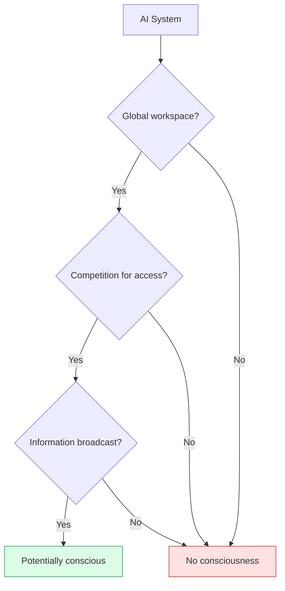
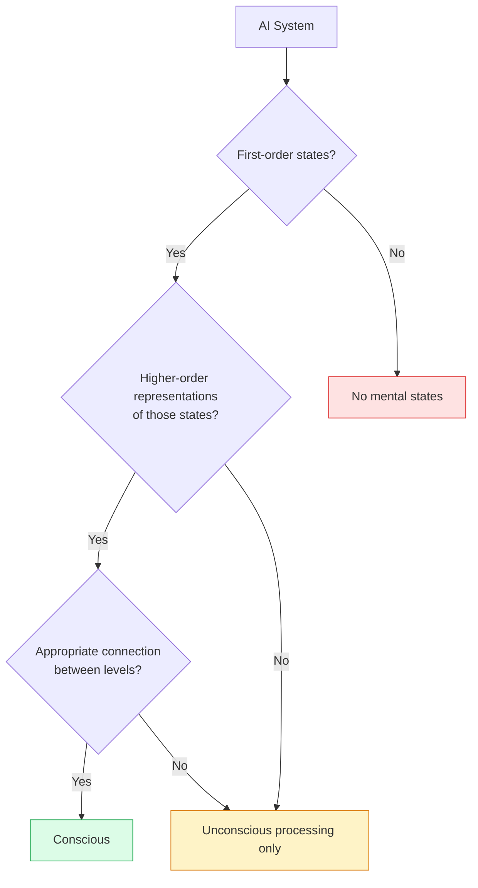
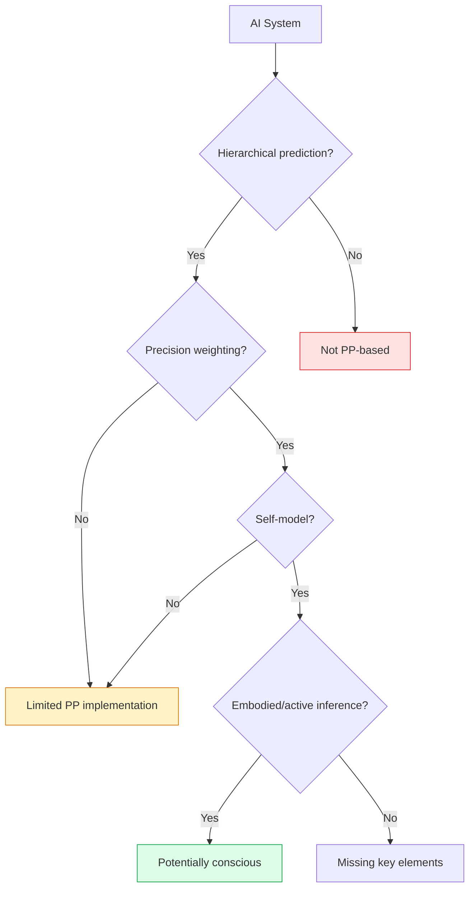

import { Card, CardGrid, Aside } from '@astrojs/starlight/components';
import Quiz from '@/components/Quiz';

## Theory by Theory Analysis

Each theory of consciousness gives us different tools for thinking about AI. Let's examine how each theory evaluates current and potential future AI systems.

## IIT and AI

### The Core Question for IIT

IIT asks: **Does the system have high integrated information (Φ)?**

### Why IIT Is Skeptical of Current AI

<CardGrid>
  <Card title="Modular Architecture" icon="warning">
    GPUs process in parallel, independently. Information doesn't deeply integrate across all processing units.
  </Card>
  <Card title="Feed-Forward Dominance" icon="seti:pipeline">
    Most neural networks are primarily feed-forward. IIT emphasizes recurrent, bidirectional causation.
  </Card>
  <Card title="Simulation ≠ Instantiation" icon="puzzle">
    Running a high-Φ system on a low-Φ computer doesn't create high Φ. The substrate matters.
  </Card>
  <Card title="Digital Discrete Processing" icon="document">
    Digital gates operate independently at each time step. There's no continuous causal integration.
  </Card>
</CardGrid>

### Could Future AI Be Conscious Under IIT?

Possibly, but it would require:
- **Neuromorphic hardware**: Physical systems that actually integrate information
- **Non-modular design**: Architectures where parts genuinely depend on each other
- **Analog processing**: Continuous, not discrete, state changes

<Aside type="note">
Tononi has suggested that a "brain in a vat" scenario—simulating a brain on a digital computer—would not be conscious under IIT, even if the simulation perfectly matched brain behavior.
</Aside>

## GWT and AI

### The Core Question for GWT

GWT asks: **Does the system have global information broadcast?**

### How Do Transformers Compare?

Large Language Models like GPT use **attention mechanisms** that have some workspace-like properties:

| GWT Feature | Transformer Equivalent | Match? |
|-------------|----------------------|--------|
| Global workspace | Attention layer | Partial |
| Competition | Attention weights | Partial |
| Broadcast | All tokens access attention | Partial |
| Multiple systems | Different heads/layers | Partial |

### Limitations of Current AI

<Card title="No Clear Access/Non-Access Distinction">
In humans, there's a clear difference between conscious and unconscious processing. In transformers, all tokens are processed similarly—there's no privileged "workspace" access.
</Card>

<Card title="No Ignition Dynamics">
GWT predicts "ignition"—a sudden, threshold-crossing transition. Transformers process gradually without clear conscious/unconscious transitions.
</Card>

<Card title="No Persistence">
Human consciousness involves maintaining information over time in the workspace. Transformer processing is relatively instantaneous without comparable persistence.
</Card>

### What AI Would Need for GWT

- **Explicit workspace architecture**: A designated hub for broadcast
- **Threshold dynamics**: Clear distinction between accessed and non-accessed information
- **Temporal persistence**: Maintaining information in the workspace over time
- **Multiple specialized systems**: That read from and write to the workspace

## HOT and AI

### The Core Question for HOT

HOT asks: **Does the system have higher-order representations of its own states?**

### The LLM Meta-Cognition Problem

LLMs produce statements about their own "thinking":
- "I think the answer is..."
- "I'm not sure about..."
- "Let me reconsider..."

Is this genuine higher-order representation or just learned patterns?

<CardGrid>
  <Card title="For Genuine HOT" icon="star">
    - The model does represent its own processing
    - It has internal states it's "reporting" on
    - Meta-cognitive training encourages self-modeling
  </Card>
  <Card title="Against Genuine HOT" icon="warning">
    - It's mimicking human language patterns
    - No clear distinction between processing and meta-processing
    - The model may not "have" states to represent
  </Card>
</CardGrid>

### What AI Would Need for HOT

- **Genuine first-order representations**: Real mental content, not just input-output mapping
- **Meta-representational architecture**: A system that explicitly models its own states
- **Appropriate causation**: Higher-order states caused by (and about) first-order states
- **Distinct levels**: Clear separation between processing and meta-processing

## PP and AI

### The Core Question for PP

PP asks: **Does the system engage in hierarchical prediction with self-modeling?**

### Current AI as Predictive Systems

| AI System | Prediction Type | Self-Model? | Embodied? |
|-----------|-----------------|-------------|-----------|
| GPT | Next-token prediction | Weak/uncertain | No |
| World models | State/action prediction | Sometimes | In simulation |
| Active inference agents | Free energy minimization | Can be built in | Often |
| Robots with PP | Hierarchical prediction | Can be built in | Yes |

### What's Missing in Current AI

<Card title="Hierarchical Depth">
Human brains have deep hierarchies with predictions at many levels. Most AI has shallower hierarchies.
</Card>

<Card title="Genuine Self-Model">
A model of the self as an embodied agent in the world, including interoception (internal body states).
</Card>

<Card title="Active Inference">
Not just passive prediction, but acting on the world to minimize prediction error. Requires embodiment.
</Card>

<Card title="Precision Dynamics">
Flexible attention that modulates the weight of prediction errors based on context and reliability.
</Card>

## Synthesis: What Would Conscious AI Look Like?

Combining insights from all theories, conscious AI might need:

| Feature | Why It Matters |
|---------|----------------|
| **Integration** | IIT: Parts must work as a unified whole |
| **Global access** | GWT: Information must be broadly available |
| **Self-representation** | HOT: Must model its own states |
| **Hierarchical prediction** | PP: Must predict at multiple levels |
| **Embodiment/action** | PP: Must engage with the world |
| **Temporal continuity** | All: Consciousness persists over time |

<Aside type="tip" title="The Convergence">
Despite their differences, the theories [converge on some requirements](https://arxiv.org/abs/2308.08708): integration, self-modeling, and rich internal structure. AI that lacks these is unlikely to be conscious under any major theory.
</Aside>

## Test Your Understanding

<Quiz
  client:load
  title="Theories Applied to AI"
  questions={[
    {
      question: "Under IIT, why doesn't a perfect functional emulation of a brain produce consciousness if run on a standard computer?",
      options: [
        "The emulation runs too slowly",
        "The computer's modular, feed-forward architecture has low Φ regardless of what it simulates",
        "Digital computers can't process information",
        "The emulation would lack neurons"
      ],
      correctIndex: 1,
      explanation: "IIT is anti-functionalist: what matters is the actual causal structure, not what it simulates. A computer emulating a brain produces identical outputs, but the computer itself remains modular with low integrated information. The Φ of the simulation is the Φ of the hardware, not the simulated system."
    },
    {
      question: "Transformer attention mechanisms partially resemble GWT's global workspace, but differ critically in that:",
      options: [
        "Transformers don't use attention",
        "Transformers lack the threshold 'ignition' dynamics and clear distinction between conscious and unconscious processing",
        "Transformers process too much information",
        "Transformers are too slow"
      ],
      correctIndex: 1,
      explanation: "GWT posits a threshold: information either enters the workspace (conscious) or doesn't (unconscious). Transformers apply attention to all tokens simultaneously with graded weights—there's no discrete ignition event or clear access/non-access distinction. The architecture is similar but the dynamics are fundamentally different."
    },
    {
      question: "An LLM that generates 'I'm thinking about this problem' could satisfy HOT requirements only if:",
      options: [
        "The statement is grammatically correct",
        "There's a genuine internal state that the statement is ABOUT, distinct from the processing that generates the statement",
        "The LLM can also generate other self-referential statements",
        "Humans find the statement convincing"
      ],
      correctIndex: 1,
      explanation: "HOT requires genuine meta-representation: a first-order state AND a separate higher-order representation OF that state. For LLMs, we must ask: is there a real 'thinking' state that the model represents, or is it just generating plausible text? Producing the words isn't enough; there needs to be the right representational structure."
    },
    {
      question: "According to PP, current LLMs fall short of consciousness primarily because they lack:",
      options: [
        "The ability to predict the next token",
        "Sufficient parameters for complex computation",
        "Hierarchical self-models and active inference—models of themselves as embodied agents acting on the world",
        "Access to real-time sensory data"
      ],
      correctIndex: 2,
      explanation: "LLMs do prediction (next token), but PP-based consciousness theories emphasize self-modeling and active inference. LLMs lack models of themselves as embodied agents, don't engage in action-perception loops, and don't minimize prediction error by acting on the world. They predict but don't self-model or actively infer."
    }
  ]}
/>

## Next Steps

Now that we understand how theories apply to AI, the crucial question remains: **How would we know?** Explore [Tests and Markers](/ai-consciousness/03-tests-and-markers/) of consciousness.
