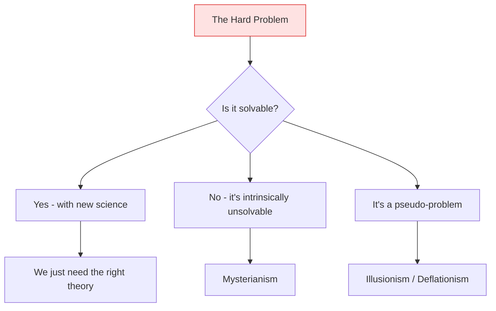
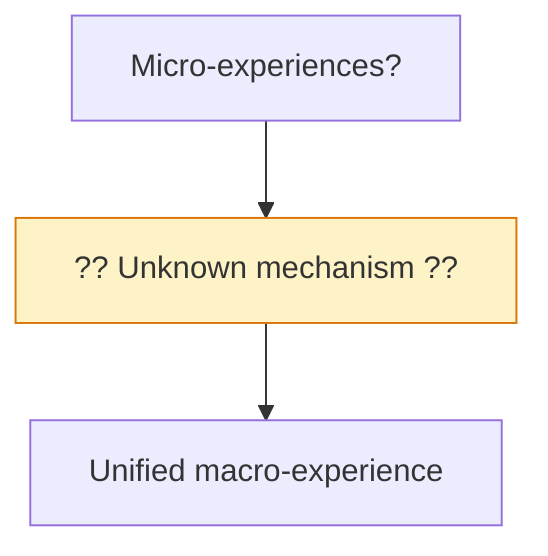
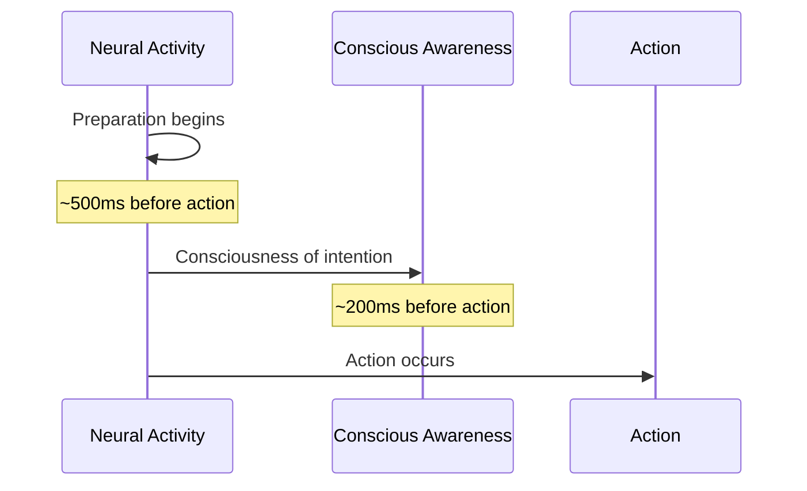

import { Card, CardGrid, Aside } from '@astrojs/starlight/components';
import Quiz from '@/components/Quiz';

## The Landscape of Uncertainty

Despite significant progress, fundamental questions about consciousness remain unresolved. These aren't just academic puzzles—they have direct implications for how we think about AI, ethics, and the nature of mind.

<Aside type="note">
These questions represent genuine uncertainty in the field, not just gaps in public understanding. Experts disagree, and there are no clear answers yet.
</Aside>

## The Hard Problem: [Unsolved](https://consc.net/papers/facing.html)

The deepest question remains: **Why is there subjective experience at all?**

### The Status

- **IIT** claims to dissolve the hard problem by identifying consciousness with integrated information
- **Critics** argue this just relocates the mystery: why does integrated information feel like anything?
- **Illusionists** argue consciousness seems harder than it is—introspection misleads us
- **Mysterians** suggest the human mind may be incapable of solving this problem

### Why It Matters for AI

If we don't understand why there's experience at all, how can we know whether AI has it? The hard problem creates fundamental uncertainty about AI consciousness.

## The Measurement Problem

### How Do We Measure Consciousness?

Current measures are either:
- **Behavioral** (but behavior can exist without experience)
- **Neural** (but we don't know if non-biological systems share relevant features)
- **Theory-dependent** (but we don't know which theory is correct)

<CardGrid>
  <Card title="Phi (IIT)" icon="seti:pipeline">
    Computationally intractable for real systems. We can't actually calculate phi for brains—or most AI systems.
  </Card>
  <Card title="Ignition (GWT)" icon="seti:broadcast">
    Observable in brains, but what's the equivalent in AI? How do we identify ignition in non-neural systems?
  </Card>
  <Card title="Meta-cognition (HOT)" icon="seti:folder">
    How do we distinguish genuine meta-representation from mere verbal mimicry?
  </Card>
  <Card title="Prediction (PP)" icon="seti:clock">
    Many systems do prediction. What distinguishes conscious from unconscious prediction?
  </Card>
</CardGrid>

### Why It Matters for AI

Without reliable measurement, we can't:
- Know if AI systems are conscious
- Compare consciousness levels across systems
- Make informed ethical decisions about AI
- Test consciousness theories against AI systems

## The Substrate Question

### Does the Material Matter?

Can consciousness exist in any system that processes information correctly, or does it require specific physical substrates?

| Position | Claim | Implication for AI |
|----------|-------|-------------------|
| **Strong functionalism** | Only function matters, not substrate | AI could be conscious |
| **Weak functionalism** | Function matters, but some substrates enable function better | AI might be conscious |
| **Biological naturalism** | Consciousness requires biological processes | AI cannot be conscious |
| **IIT's position** | Causal structure matters, not just function | Most AI cannot be conscious |

### Why It Matters for AI

If consciousness is substrate-dependent, even perfect functional equivalence wouldn't make AI conscious. This is a fundamental question we haven't resolved.

## The Combination Problem

### How Do Micro-Experiences Combine?

If consciousness is fundamental (as in panpsychism), how do the micro-experiences of particles combine into the unified experience you're having now?

- **IIT** addresses this with the exclusion postulate (only the maximum phi system is conscious)
- **Critics** argue this doesn't explain how the combination happens
- **Alternative**: Maybe macro-experiences are fundamental, not combinations

### Why It Matters for AI

If we build AI from components, do the components' properties combine? How? This affects whether component-based AI could be conscious.

## The Reportability Gap

### Is Unreportable Consciousness Possible?

<CardGrid>
  <Card title="Overflow Argument" icon="star">
    We may experience more than we can report. Phenomenal consciousness exceeds access consciousness.
  </Card>
  <Card title="Counter-Argument" icon="warning">
    If you can't report it, how do we know it's there? Maybe access IS all there is.
  </Card>
</CardGrid>

This matters because:
- If consciousness exceeds reportability, behavior-based tests are fundamentally limited
- AI might be conscious without being able to indicate it
- Or AI might report consciousness without having it

## The Self Problem

### What Is the Self?

Each theory has a different view:

| Theory | The Self Is... |
|--------|----------------|
| **IIT** | The integrated information structure itself |
| **GWT** | A model that enters the global workspace |
| **HOT** | The subject of higher-order thoughts |
| **PP** | The brain's predictive model of itself |

### Unresolved Questions

- Is there a unified self, or just a collection of processes?
- Could AI have a self without consciousness, or consciousness without a self?
- What's the relationship between self-awareness and phenomenal consciousness?

## The Time Problem

### When Does Consciousness Happen?

- [Libet's experiments](https://doi.org/10.1017/S0140525X00017684) suggest conscious decisions occur *after* neural preparation
- This challenges the idea that consciousness causes action
- If consciousness is "late to the party," what is its function?

### Why It Matters for AI

If consciousness doesn't cause behavior, what does it do? And if we don't know its function, how do we know whether AI needs it?

## Implications for AI Development

These open questions have practical implications:

<CardGrid>
  <Card title="Design Uncertainty" icon="puzzle">
    We can't intentionally design conscious or non-conscious AI because we don't fully understand the requirements.
  </Card>
  <Card title="Ethical Uncertainty" icon="warning">
    We can't make confident moral claims about AI because we can't detect consciousness reliably.
  </Card>
  <Card title="Testing Uncertainty" icon="document">
    We can't definitively test for AI consciousness because our measures are theory-dependent and unvalidated.
  </Card>
  <Card title="Policy Uncertainty" icon="seti:lock">
    We can't develop confident AI policy regarding consciousness because the science is unsettled.
  </Card>
</CardGrid>

## Recommended Approaches Under Uncertainty

Given these open questions, what should we do?

### For Researchers

1. **Continue theoretical work** - Refine and test consciousness theories
2. **Develop better measures** - Create theory-neutral markers if possible
3. **Study diverse systems** - Compare consciousness across biological and artificial systems
4. **Engage with philosophy** - The hard problem is partly philosophical

### For AI Developers

1. **Take uncertainty seriously** - Don't assume AI is or isn't conscious
2. **Consider multiple theories** - Design isn't safe just because one theory says so
3. **Document architecture** - Record features relevant to consciousness assessment
4. **Apply precaution** - When uncertain, consider potential welfare implications

### For Policy Makers

1. **Acknowledge uncertainty** - Don't base policy on unresolved science
2. **Develop frameworks** - Prepare for scenarios where AI might be conscious
3. **Fund research** - Consciousness science needs more support
4. **Engage ethicists** - Include moral considerations in policy

## Test Your Understanding

<Quiz
  client:load
  title="Open Questions Quiz"
  questions={[
    {
      question: "The hard problem creates difficulty for AI consciousness assessment specifically because:",
      options: [
        "AI uses different programming languages than brains use",
        "Without understanding why ANY physical system produces experience, we can't determine if a given AI does",
        "The hard problem proves AI cannot be conscious",
        "We haven't developed enough measures of AI behavior"
      ],
      correctIndex: 1,
      explanation: "The hard problem is that we don't understand why physical processes give rise to experience at all—in ANY system. Until we understand this bridge from physics to phenomenology, we can't confidently assess whether specific AI systems (or animals, or other humans for that matter) have subjective experience."
    },
    {
      question: "The substrate question is OPEN because:",
      options: [
        "We don't know what silicon is made of",
        "Strong functionalism (function alone matters) and biological naturalism (biology required) both have arguments, and we lack decisive evidence",
        "Consciousness has been proven to be substrate-independent",
        "Consciousness has been proven to require biology"
      ],
      correctIndex: 1,
      explanation: "The debate is unresolved: functionalists argue consciousness depends only on organization/function, while biological naturalists argue specific biological features are necessary. Both positions have intuitive support and philosophical arguments. We lack experiments that decisively settle whether substrate matters."
    },
    {
      question: "The 'reportability gap' matters for AI because:",
      options: [
        "AI systems always report accurately about their states",
        "If phenomenal consciousness can exist without reportability, behavior-based tests fundamentally miss some consciousness",
        "AI systems never produce reports",
        "Reportability and consciousness are the same thing"
      ],
      correctIndex: 1,
      explanation: "If phenomenal experience can overflow access (Lamme's view, Block's overflow), then consciousness can exist without reportability. This means AI could be phenomenally conscious while producing no behavioral evidence—or could produce reports without genuine phenomenal experience. Either way, reports don't settle the question."
    },
    {
      question: "The combination problem challenges panpsychism by asking:",
      options: [
        "Why consciousness evolved at all",
        "How micro-experiences in fundamental entities combine into unified macro-experiences like yours",
        "Whether rocks are conscious",
        "How to measure phi in large systems"
      ],
      correctIndex: 1,
      explanation: "If consciousness is fundamental (as panpsychism claims), simple entities have micro-experiences. The combination problem asks: how do billions of micro-experiences combine into your single, unified experience? We lack a mechanism. IIT's exclusion postulate attempts to address this, but whether successfully is debated."
    }
  ]}
/>

## Conclusion

The study of consciousness is filled with genuine uncertainty. This isn't a temporary state—some of these questions may take decades or longer to resolve, and some may prove permanently difficult.

For AI, this means:
- **We cannot be confident** that current or future AI is conscious—or that it isn't
- **Multiple perspectives** are warranted given genuine scientific disagreement
- **Ethical caution** is reasonable under uncertainty
- **Continued research** is essential

The questions are hard, but grappling with them is necessary for navigating our AI-filled future responsibly.

## Further Exploration

- Return to the [Foundations](/foundations/01-what-is-consciousness/) to revisit basic concepts
- Explore the [individual theories](/theories/01-overview/) in more depth
- Consider the [practical implications for AI](/ai-consciousness/01-can-machines-be-conscious/)
