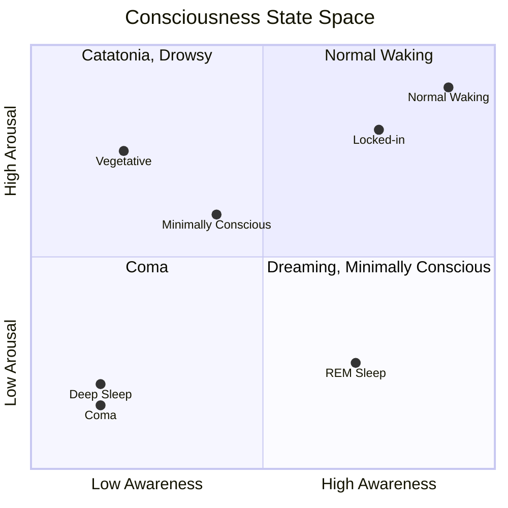
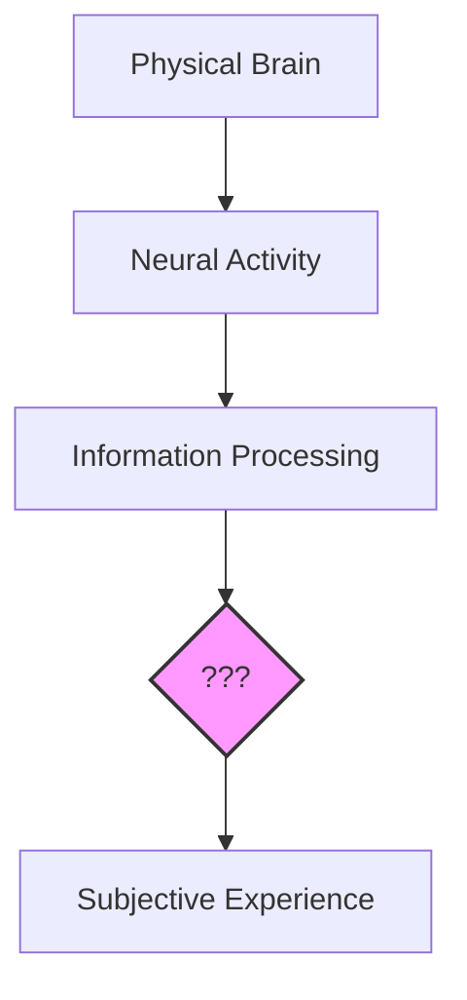

import { Card, CardGrid, Aside } from '@astrojs/starlight/components';
import Quiz from '@/components/Quiz';

## The Most Familiar Mystery

You are conscious right now. You're experiencing these words, perhaps hearing an inner voice as you read, aware of your surroundings, feeling sensations in your body. This immediate, undeniable experience is consciousness.

Yet despite being the most familiar thing in the universe to each of us, consciousness remains one of the deepest mysteries in science and philosophy. We can describe the brain in exquisite detail, map neural connections, and measure electrical activity. But how does this physical machinery give rise to the subjective experience of *being* someone?

<Aside type="tip" title="Key Insight">
Consciousness is not just about processing information or responding to stimuli. It's about there being [*something it is like*](https://www.jstor.org/stable/2183914) to have those experiences.
</Aside>

## Defining Consciousness

The term "consciousness" is used in different ways across philosophy and neuroscience. Understanding these distinctions is crucial—they're not interchangeable.

### Philosophy: Types of Consciousness

Philosophers, following [Ned Block (1995)](https://doi.org/10.1017/S0140525X00038188), draw a fundamental distinction:

<CardGrid>
  <Card title="Phenomenal Consciousness (P-consciousness)" icon="star">
    The subjective, experiential aspect of mental life—the "what it's like" quality. When you see red, there's something it *feels like* to see red. This is the core mystery.
  </Card>
  <Card title="Access Consciousness (A-consciousness)" icon="puzzle">
    Information that is available for reasoning, reporting, and guiding behavior. You can talk about what you're experiencing and use it to make decisions.
  </Card>
</CardGrid>

Block argues these can come apart: you might have phenomenal experience without access (experiencing more than you can report), or access without phenomenal experience (if that's possible—this is debated).

[Rosenthal](https://doi.org/10.1093/acprof:oso/9780199838721.001.0001) adds another useful distinction:
- **Creature consciousness**: Is the organism conscious at all?
- **State consciousness**: Is this particular mental state conscious?

**Self-consciousness** (awareness of oneself as a distinct individual) is typically treated as a *higher-order* or *reflexive* form of consciousness—not a basic type, but a special case where consciousness is directed at the self.

### Neuroscience: Two Dimensions

Clinical neuroscience uses a different framework—two orthogonal *dimensions* rather than types:

| Dimension | What it measures | Neural basis |
|-----------|------------------|--------------|
| **Arousal/Wakefulness** | Sleep-wake state, alertness | Brainstem, thalamus |
| **Awareness/Content** | What you're conscious *of* | Cortex, thalamo-cortical loops |

This framework explains clinical states:
- **Coma**: Low arousal, low awareness
- **Vegetative state**: High arousal (eyes open), minimal awareness
- **Locked-in syndrome**: Full arousal AND awareness, but paralyzed

<Aside type="caution" title="Don't Conflate Wakefulness and Consciousness">
Wakefulness (arousal) is *not* the same as consciousness (awareness). You can be awake but not conscious of something (inattentional blindness). You can be conscious while not awake (dreams). The neuroscience framework treats these as independent dimensions.
</Aside>

## The Core Question

When scientists study consciousness, they're primarily interested in **phenomenal consciousness**: why and how there is subjective experience at all.

Consider a thought experiment: Imagine a robot that processes visual information, navigates the world, and reports on what it "sees." Is there something it's like to *be* that robot? Does it have visual experiences, or is it just processing data in the dark?

This question—whether a system has genuine subjective experience or is merely going through the motions—lies at the heart of consciousness studies. It becomes especially pressing when we consider AI.

The "???" in the diagram represents the [**hard problem of consciousness**](https://consc.net/papers/facing.html)—the gap between physical processes and subjective experience that we don't know how to bridge.

## Why Does This Matter?

Understanding consciousness has profound implications:

| Domain | Implication |
|--------|-------------|
| **AI & Ethics** | If AI becomes conscious, should it have rights? How would we know? |
| **Medicine** | Determining consciousness in patients who can't communicate (coma, locked-in syndrome) |
| **Animal Welfare** | Which animals are conscious? How does this affect our moral obligations? |
| **Philosophy of Mind** | What is the relationship between mind and matter? |
| **Personal Identity** | What makes you *you* over time? What would survive uploading your mind? |

## The Landscape Ahead

In this wiki, we'll explore the major scientific theories that attempt to explain consciousness:

1. [**Integrated Information Theory (IIT)**](https://doi.org/10.1186/1471-2202-5-42) - Consciousness is integrated information
2. [**Global Workspace Theory (GWT)**](https://doi.org/10.1016/S1364-6613(98)01271-0) - Consciousness is global information broadcast
3. [**Higher-Order Theories (HOT)**](https://doi.org/10.1093/acprof:oso/9780199838721.001.0001) - Consciousness requires thoughts about thoughts
4. [**Predictive Processing (PP)**](https://doi.org/10.1017/S0140525X12000477) - Consciousness emerges from prediction error minimization
5. [**Recurrent Processing Theory (RPT)**](https://doi.org/10.1016/j.tics.2006.03.007) - Consciousness requires recurrent neural activity
6. [**Attention Schema Theory (AST)**](https://doi.org/10.3389/fnhum.2015.00500) - Consciousness is the brain's model of its own attention
7. [**Orchestrated Objective Reduction (Orch OR)**](https://doi.org/10.1016/j.plrev.2013.08.002) - Consciousness arises from quantum processes in microtubules

Each offers a different perspective on what consciousness is and, crucially, what it would take for an AI to be conscious.

## Test Your Understanding

<Quiz
  client:load
  title="Foundations Check"
  questions={[
    {
      question: "A robot processes visual information, navigates obstacles, and verbally reports 'I see a red ball.' Using Block's distinction, what can we conclude?",
      options: [
        "The robot has both phenomenal and access consciousness",
        "The robot demonstrates access consciousness, but phenomenal consciousness remains uncertain",
        "The robot lacks both types of consciousness since it's not biological",
        "The robot has phenomenal consciousness but lacks access consciousness"
      ],
      correctIndex: 1,
      explanation: "The robot clearly demonstrates access consciousness—information is available for report and behavior. What's uncertain is phenomenal consciousness: is there 'something it's like' to be the robot? Block's distinction highlights that behavioral evidence (access) doesn't establish subjective experience (phenomenal)."
    },
    {
      question: "A patient in a vegetative state has eyes open and sleep-wake cycles, but shows no signs of awareness. Using the neuroscience two-dimensional framework, this patient has:",
      options: [
        "Low arousal, low awareness",
        "High arousal, low awareness",
        "Low arousal, high awareness",
        "High arousal, high awareness"
      ],
      correctIndex: 1,
      explanation: "The vegetative state is characterized by preserved arousal (wakefulness—eyes open, sleep-wake cycles) but minimal or absent awareness (no evidence of conscious content). This shows why the two dimensions are independent: you can be 'awake' without being aware."
    },
    {
      question: "Why do philosophers treat self-consciousness as a 'higher-order' form rather than a basic type alongside phenomenal/access consciousness?",
      options: [
        "Self-consciousness is less important than other types",
        "Self-consciousness is consciousness directed at oneself—a special case requiring reflexive representation",
        "Self-consciousness only exists in humans",
        "Self-consciousness is identical to access consciousness"
      ],
      correctIndex: 1,
      explanation: "Self-consciousness isn't a separate basic type—it's phenomenal or access consciousness with a particular content (the self). It requires reflexive representation: being conscious OF one's own states. This makes it a higher-order phenomenon that presupposes more basic forms of consciousness."
    },
    {
      question: "Block argues phenomenal and access consciousness can 'come apart.' Which scenario illustrates this?",
      options: [
        "Being awake vs. being asleep",
        "Experiencing a rich visual scene but only being able to report a few items from it",
        "Knowing facts about colors vs. seeing colors",
        "Human consciousness vs. animal consciousness"
      ],
      correctIndex: 1,
      explanation: "The 'overflow' argument: you phenomenally experience more of a visual scene than you can access (report, reason about). When the scene disappears, you could only report ~4 items, but your phenomenal experience seemed richer. This suggests P-consciousness can exceed A-consciousness—though this interpretation is debated."
    }
  ]}
/>

## Next Steps

Ready to dive deeper? The next page explores the **hard problem of consciousness**—why explaining subjective experience is so difficult, and the thought experiments that illuminate the challenge.
