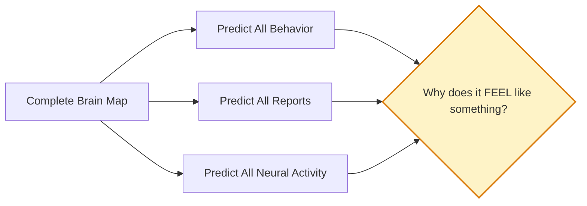
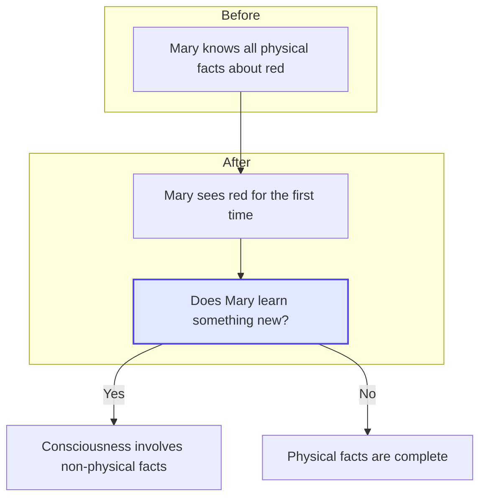

import { Card, CardGrid, Aside } from '@astrojs/starlight/components';
import Quiz from '@/components/Quiz';

## Easy vs Hard Problems

In 1995, philosopher [David Chalmers](https://consc.net/papers/facing.html) made a distinction that clarified why consciousness is so puzzling. He distinguished between the **easy problems** and the **hard problem** of consciousness.

<CardGrid>
  <Card title="Easy Problems" icon="rocket">
    - How does the brain integrate information?
    - How do we focus attention?
    - How do we report on mental states?
    - How does the brain control behavior?

    *These are "easy" not because they're simple, but because we know what a solution would look like: discover the mechanisms.*
  </Card>
  <Card title="The Hard Problem" icon="warning">
    Why is there subjective experience at all? Why does information processing *feel like something* rather than happening "in the dark"?

    *This is "hard" because even a complete mechanistic explanation seems to leave the question open.*
  </Card>
</CardGrid>

<Aside type="note">
The easy problems may take centuries to solve, but they're tractable in principle. For the hard problem, we don't even know what a solution would look like.
</Aside>

## The Explanatory Gap

Consider this scenario: Imagine future neuroscientists have mapped every neuron in your brain. They can predict exactly what you'll experience when you see red. They know which neurons fire, which chemicals are released, which regions activate.

Have they explained consciousness?

They've explained the *correlates* of consciousness—what brain states accompany experience. But they haven't explained why those brain states *feel like something*. This is the [**explanatory gap**](https://doi.org/10.1111/j.1468-0114.1983.tb00207.x).

## Thought Experiments

Philosophers have devised thought experiments to sharpen our intuitions about the hard problem.

### [The Zombie Argument](https://plato.stanford.edu/entries/zombies/)

Imagine a being physically identical to you—same neurons, same chemistry, same behavior—but with no inner experience. A "philosophical zombie." It acts exactly as you do, says "I'm conscious," but there's nothing it's like to be it inside.

**The argument:**
1. Zombies are conceivable (we can imagine them without contradiction)
2. If zombies are conceivable, consciousness isn't logically entailed by physical facts
3. Therefore, consciousness is something "extra" beyond the physical

<Aside type="caution" title="Controversy">
Many philosophers reject the zombie argument. Some say zombies aren't truly conceivable. Others argue that conceivability doesn't prove possibility. But the thought experiment illuminates what's puzzling about consciousness.
</Aside>

### [Mary's Room](https://doi.org/10.2307/2960077) (The Knowledge Argument)

Mary is a brilliant scientist who knows everything physical about color vision. She knows the wavelengths of light, which neurons fire when seeing red, how the brain processes color information. But Mary has lived her entire life in a black-and-white room and has never actually *seen* red.

One day, Mary leaves the room and sees a red tomato for the first time.

**Does she learn something new?**

If yes, then there are facts about experience that aren't captured by physical facts. The "what it's like" of seeing red is something over and above the physical description.

### The Inverted Spectrum

Imagine someone whose color experiences are inverted relative to yours. When they see what you call "red," they have the experience you call "green," and vice versa. But they learned color words the same way you did, so they use "red" to refer to tomatoes.

This person is behaviorally identical to you. Could you ever tell the difference? The thought experiment suggests that subjective experience could vary while behavior stays the same—another sign that consciousness is something extra.

## Responses to the Hard Problem

Different thinkers respond to the hard problem in different ways:

| Position | Response |
|----------|----------|
| **Dualism** | Consciousness is genuinely non-physical. There are two kinds of stuff: matter and mind. |
| **Materialism/Physicalism** | The hard problem is solvable in principle. Consciousness will be explained by physics eventually. |
| **[Illusionism](https://doi.org/10.1093/acprof:oso/9780199845309.003.0011)** | The hard problem is based on an illusion. Consciousness seems mysterious but isn't really. |
| **Panpsychism** | Consciousness is fundamental to reality. Even basic matter has proto-conscious properties. |
| **[Mysterianism](https://doi.org/10.1093/mind/98.391.349)** | The hard problem may be unsolvable for human minds, like calculus is unsolvable for cats. |

## What This Means for AI

The hard problem is crucial for AI consciousness debates:

- If consciousness is purely functional (information processing), AI could be conscious
- If consciousness requires specific physical substrate, silicon-based AI might never be conscious
- If we can't bridge the explanatory gap, we may never *know* if AI is conscious

<Aside type="tip" title="Key Takeaway">
The hard problem doesn't mean consciousness is supernatural. It means our current understanding has a gap that hasn't been bridged. The theories we'll explore each offer different strategies for addressing this gap.
</Aside>

## Test Your Understanding

<Quiz
  client:load
  title="Hard Problem Quiz"
  questions={[
    {
      question: "An illusionist about consciousness would respond to Mary's Room by arguing:",
      options: [
        "Mary learns a genuinely new fact about the non-physical nature of experience",
        "Mary gains a new ability (to recognize/imagine red) but no new factual knowledge",
        "Mary's room scenario is physically impossible",
        "Mary was never truly colorblind in the first place"
      ],
      correctIndex: 1,
      explanation: "Illusionists (and some physicalists) argue Mary gains a new ability or way of representing red, but not genuinely new factual knowledge. The 'what it's like' seems like new information but is actually just a different cognitive access to the same physical facts. This dissolves the anti-physicalist conclusion."
    },
    {
      question: "The philosophical zombie argument FAILS if:",
      options: [
        "We cannot actually build a physical zombie",
        "Zombies are conceivable but not metaphysically possible",
        "Zombies would behave differently than conscious beings",
        "The brain is very complex"
      ],
      correctIndex: 1,
      explanation: "The zombie argument requires going from conceivability (we can imagine zombies) to possibility (zombies could exist). Critics argue conceivability doesn't entail metaphysical possibility—we might be able to imagine something that's actually impossible. If zombies are impossible despite being conceivable, the argument fails to show consciousness is non-physical."
    },
    {
      question: "The 'explanatory gap' differs from the 'hard problem' in that:",
      options: [
        "They are the same concept with different names",
        "The explanatory gap is about our current epistemic limitations, while the hard problem may be about consciousness itself",
        "The hard problem is easier to solve than the explanatory gap",
        "The explanatory gap only applies to visual consciousness"
      ],
      correctIndex: 1,
      explanation: "The explanatory gap (Levine) refers to our inability to explain why physical processes produce specific experiences—an epistemic gap. The hard problem (Chalmers) is often framed as a deeper metaphysical question about the relationship between physical and phenomenal. One might think the gap will eventually close (epistemic optimism) while still agreeing the problem is currently hard."
    },
    {
      question: "A mysterian like Colin McGinn would argue that:",
      options: [
        "Consciousness is supernatural and beyond science",
        "Our cognitive limitations may permanently prevent us from understanding consciousness",
        "The hard problem is actually easy once we have better brain scans",
        "Consciousness doesn't really exist"
      ],
      correctIndex: 1,
      explanation: "Mysterianism holds that human minds may have permanent cognitive limitations preventing us from solving the hard problem—like how a dog can't understand calculus. This isn't saying consciousness is supernatural, just that our brains may not be equipped to understand how brains produce experience. The answer might exist but be cognitively inaccessible to us."
    }
  ]}
/>

## Next Steps

Now that we understand the hard problem, let's explore **qualia**—the subjective qualities of experience that make the hard problem so vivid.
