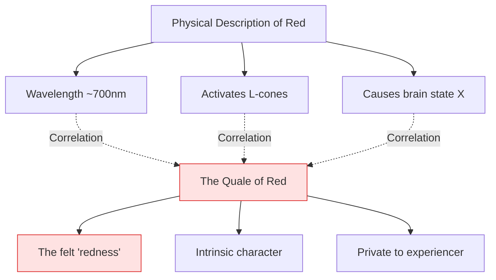
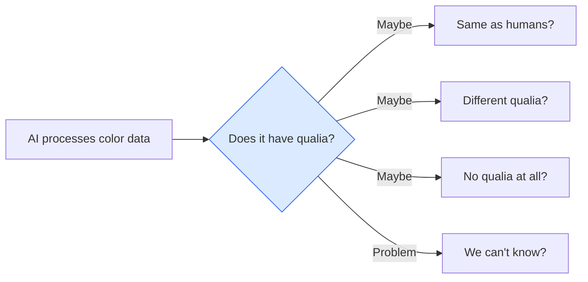

import { Card, CardGrid, Aside } from '@astrojs/starlight/components';
import Quiz from '@/components/Quiz';

## What Are Qualia?

[**Qualia**](https://plato.stanford.edu/entries/qualia/) (singular: quale) are the subjective, qualitative aspects of conscious experience. They're the "raw feels" of perception—the redness of red, the painfulness of pain, the sweetness of sugar.

When you stub your toe, there's an objective, measurable aspect: tissue damage, nerve signals, brain activation. But there's also the *felt quality* of the pain—what it's like to experience it. That felt quality is the quale of pain.

<Aside type="tip" title="Pronunciation">
Qualia is pronounced "KWAH-lee-uh" (the 'a' sounds like 'a' in 'father'). The singular "quale" is "KWAH-lay."
</Aside>

## Examples of Qualia

<CardGrid>
  <Card title="Visual Qualia" icon="star">
    The experienced quality of colors. The vibrant red of a sunset isn't just a wavelength—it has a *felt character* to it.
  </Card>
  <Card title="Auditory Qualia" icon="seti:audio">
    The sound of a violin has a quality distinct from a trumpet playing the same note. This qualitative difference is qualia.
  </Card>
  <Card title="Taste Qualia" icon="heart">
    The distinctive taste of coffee versus tea. Beyond chemical composition, there's what they *taste like*.
  </Card>
  <Card title="Pain Qualia" icon="warning">
    The unpleasant quality of pain. A burning pain feels different from a sharp pain—these are different qualia.
  </Card>
</CardGrid>

## Why Qualia Are Puzzling

Qualia are at the heart of the hard problem because they seem to resist physical explanation.

### The Privacy Problem

Your qualia are private. No one else can directly access your experience of red. I can measure your brain activity, observe your behavior, and hear your reports—but I can't *experience* your experience.

### The Ineffability Problem

Qualia are hard to describe in words. How would you explain what red looks like to someone who's been blind from birth? You can give scientific facts (wavelength, photoreceptors), but that doesn't capture the *felt quality*.

### The Relational Problem

Physical descriptions are relational—they describe how things interact with other things. But qualia seem to have an intrinsic character that isn't captured by relations.

## Arguments About Qualia

### Do Qualia Even Exist?

Some philosophers deny that qualia, as traditionally conceived, exist:

| Position | Argument |
|----------|----------|
| **Qualia Realism** | Of course qualia exist! The red I see has a definite felt character. |
| **Representationalism** | What we call "qualia" is just how experiences represent the world. There's no extra subjective layer. |
| **[Illusionism](https://doi.org/10.14704/nq.2016.14.4.1008)** | Qualia *seem* to exist but don't really. Introspection misleads us about the nature of our experiences. |
| **Eliminativism** | "Qualia" is a confused concept. There are no such things; we should abandon the term. |

### [The Inverted Qualia Problem](https://doi.org/10.2307/2026213)

Remember the inverted spectrum from the previous page? If your experience of red could be my experience of green (while we both use "red" for tomatoes), this suggests:

1. Qualia can vary independently of behavior
2. Qualia have an intrinsic character not captured by function
3. We might never know if others' qualia match ours

<Aside type="note">
Some philosophers argue inverted qualia are impossible—that the functional role of an experience IS its qualitative character. This is the "[functionalist](https://plato.stanford.edu/entries/functionalism/)" view.
</Aside>

## Qualia and AI

The question of qualia is crucial for AI consciousness:

**If AI can be conscious, does it have qualia?**

Consider a vision AI that processes color information. It can distinguish red from green, describe colors accurately, and use color information to guide behavior. But does it have the *felt quality* of seeing red?

Several possibilities:

1. **No qualia**: The AI processes information without any subjective experience
2. **Same qualia**: The AI has experiences similar to ours
3. **Different qualia**: The AI has experiences, but utterly alien to ours
4. **Unknowable**: We can never determine whether AI has qualia

## The Explanatory Challenge

Even if we identify the neural correlates of specific qualia—"this pattern produces the experience of red"—we still face the question: *why does this pattern produce THIS quality rather than some other?*

This is sometimes called the "palette problem." Nature seems to have assigned specific qualia to specific brain states. But:

- Why does this assignment hold?
- Could it have been different?
- What determines the specific character of each quale?

## Test Your Understanding

<Quiz
  client:load
  title="Qualia Quiz"
  questions={[
    {
      question: "A representationalist about qualia would argue that:",
      options: [
        "Qualia are non-physical properties that can't be explained scientifically",
        "What we call 'qualia' is just how experiences represent properties of objects—no extra subjective layer exists",
        "Qualia prove dualism is true",
        "We can never know if other people have qualia"
      ],
      correctIndex: 1,
      explanation: "Representationalism holds that the qualitative character of experience IS its representational content—how it represents the world. Seeing red just is representing redness; there's no additional 'raw feel' beyond the representation. This deflates qualia as a separate mystery while still accepting that experiences have qualitative character."
    },
    {
      question: "If the inverted spectrum scenario is IMPOSSIBLE, this would support:",
      options: [
        "Qualia realism—that qualia are real, intrinsic properties",
        "Functionalism—that qualitative character is determined by functional role",
        "Eliminativism—that qualia don't exist at all",
        "Panpsychism—that consciousness is fundamental to all matter"
      ],
      correctIndex: 1,
      explanation: "If inverted qualia are impossible, it suggests that the functional role of an experience (how it's caused and what it causes) fully determines its qualitative character. You couldn't have inverted experiences with identical functional roles because the functional role IS the quale. This supports functionalism."
    },
    {
      question: "The 'palette problem' in qualia studies asks:",
      options: [
        "Why do artists choose certain colors over others?",
        "Why does THIS particular brain state produce THIS particular qualitative feel rather than another?",
        "How many distinct qualia can humans experience?",
        "Whether qualia can be mixed like paint colors"
      ],
      correctIndex: 1,
      explanation: "The palette problem asks why there's a specific mapping between brain states and qualitative experiences. Even if we discover that brain state X causes the experience of red, we haven't explained WHY state X produces redness rather than, say, the experience of hearing C-sharp. The assignment seems arbitrary."
    },
    {
      question: "An AI that processes color information and reports 'I experience a vivid redness' raises the question:",
      options: [
        "Whether the AI's color processing is accurate",
        "Whether functional processing and verbal report are sufficient for qualia, or whether something more is needed",
        "Whether the AI was programmed correctly",
        "Whether the AI prefers red over other colors"
      ],
      correctIndex: 1,
      explanation: "This highlights the core debate: functionalists might say the right processing and reporting IS having qualia. Qualia realists might say the AI could do all this processing without any 'felt quality.' The question exposes the gap between observable behavior and the private nature of qualitative experience."
    }
  ]}
/>

## Next Steps

With an understanding of the hard problem and qualia, we're ready to explore how science approaches consciousness. The next page covers the **science of consciousness**—what methods researchers use and what they've discovered.
