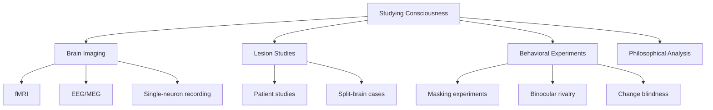
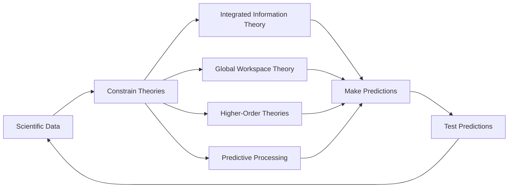

import { Card, CardGrid, Aside } from '@astrojs/starlight/components';
import Quiz from '@/components/Quiz';

## From Philosophy to Science

For most of history, consciousness was purely a philosophical topic. In recent decades, it's become a scientific research program. While the hard problem remains unsolved, scientists have made significant progress on the "easy problems"—understanding the neural correlates and mechanisms of consciousness.

<Aside type="note">
The scientific study of consciousness became mainstream in the 1990s, often called the "decade of the brain." [Francis Crick and Christof Koch's work](https://authors.library.caltech.edu/records/qg6nv-dxe95) was particularly influential in legitimizing consciousness as a scientific topic.
</Aside>

## Methods for Studying Consciousness

### Brain Imaging

Modern neuroscience uses several techniques:

| Method | What It Measures | Pros | Cons |
|--------|------------------|------|------|
| **fMRI** | Blood flow (indirect neural activity) | Good spatial resolution | Poor temporal resolution, expensive |
| **EEG** | Electrical activity on scalp | Good temporal resolution, cheap | Poor spatial resolution |
| **MEG** | Magnetic fields from neural activity | Good spatial & temporal | Very expensive |
| **Intracranial** | Direct neural recordings | Precise | Invasive, only clinical cases |

### Contrastive Analysis

A key scientific strategy is **contrastive analysis**: comparing brain states when someone is conscious of something versus when they're not.

**Example: Binocular Rivalry**

When different images are shown to each eye, you don't see a blend—you see one image, then the other, alternating. The physical stimulus stays constant, but your experience changes. By comparing brain activity during each percept, researchers can identify the neural correlates of consciousness (NCCs).

## Key Discoveries

### [The Neural Correlates of Consciousness (NCCs)](https://doi.org/10.1038/nrn3820)

NCCs are the minimal neural mechanisms sufficient for a specific conscious experience. Key findings:

<CardGrid>
  <Card title="Prefrontal-Parietal Network" icon="puzzle">
    Many studies implicate prefrontal and parietal cortex in conscious access. These areas show activity correlated with reportable awareness.
  </Card>
  <Card title="Recurrent Processing" icon="seti:clock">
    Conscious perception often involves feedback loops, not just feedforward processing. Disrupting recurrent processing can disrupt consciousness.
  </Card>
  <Card title="Global Integration" icon="seti:broadcast">
    Conscious states tend to involve widespread neural activity, not just local processing. Information seems to be "broadcast" across the brain.
  </Card>
  <Card title="40Hz Gamma Oscillations" icon="star">
    Synchronized neural oscillations, especially in the gamma range (~40Hz), often correlate with conscious perception.
  </Card>
</CardGrid>

### Consciousness Without a Cortex?

Recent research has challenged the assumption that consciousness requires a cerebral cortex:

- Children born without a cortex can show signs of awareness
- Birds (with different brain architecture) show sophisticated cognition
- Some argue consciousness could be more widespread than previously thought

### Disorders of Consciousness

Clinical cases provide crucial insights:

| Condition | Description | What It Teaches |
|-----------|-------------|-----------------|
| **Coma** | Unresponsive, no sleep-wake cycle | Consciousness requires certain brainstem functions |
| **Vegetative State** | Awake but no awareness | Wakefulness and awareness are dissociable |
| **Minimally Conscious** | Inconsistent awareness | Consciousness can be partial |
| **Locked-In Syndrome** | Aware but paralyzed | Behavior doesn't equal consciousness |

<Aside type="caution" title="Clinical Importance">
Distinguishing these states has life-or-death implications. [Recent research](https://doi.org/10.1126/science.1130197) using brain imaging has detected awareness in some patients diagnosed as vegetative, leading to revised diagnoses and treatment decisions.
</Aside>

## The Relationship Between Science and Theory

Scientific findings constrain theories of consciousness:

A good theory of consciousness should:

1. **Explain NCCs**: Why do these particular brain states correlate with consciousness?
2. **Make predictions**: What else should be true if the theory is correct?
3. **Address the hard problem**: At least attempt to explain why there's subjective experience

## Measuring Consciousness

Scientists have developed measures to assess consciousness level:

### [Perturbational Complexity Index (PCI)](https://doi.org/10.1126/scitranslmed.3006294)

Developed by Marcello Massimini and colleagues, PCI measures the brain's response to magnetic stimulation:

- **Low PCI**: Simple, stereotyped response (like in deep sleep or anesthesia)
- **High PCI**: Complex, differentiated response (like in waking consciousness)

This provides an objective correlate of consciousness level that doesn't require behavioral responses.

### Integrated Information (Φ)

IIT proposes that consciousness can be measured by calculating integrated information (phi). While the full calculation is impractical for real brains, approximations are being developed.

## The Science-Philosophy Interface

Scientific findings inform philosophical debates, and philosophical analysis guides scientific inquiry:

| Scientific Finding | Philosophical Implication |
|--------------------|---------------------------|
| NCCs in prefrontal cortex | Supports theories emphasizing higher-order processing |
| Global integration | Supports global workspace theory |
| Recurrent processing required | Feedforward-only AI may lack consciousness |
| Complexity correlates with consciousness | Supports IIT's core claim |

<Aside type="tip" title="Key Takeaway">
While science can identify the correlates and mechanisms of consciousness, the hard problem—why there's subjective experience at all—remains open. Theories attempt to bridge this gap, but none has achieved consensus.
</Aside>

## Test Your Understanding

<Quiz
  client:load
  title="Science of Consciousness Quiz"
  questions={[
    {
      question: "A patient in a vegetative state shows no behavioral responses. Using fMRI, researchers ask them to imagine playing tennis, and motor cortex activates. This finding:",
      options: [
        "Definitively proves the patient is conscious",
        "Suggests possible covert consciousness, but interpretations remain debated",
        "Proves that fMRI can directly measure consciousness",
        "Shows the patient is not actually in a vegetative state"
      ],
      correctIndex: 1,
      explanation: "This paradigm (from Owen et al., 2006) suggests command-following and possibly consciousness, but interpretation is complex. Some argue it demonstrates consciousness; others note that the activity might be automatic or that we can't know if there's subjective experience accompanying the neural response. It changed clinical practice but doesn't definitively 'prove' consciousness."
    },
    {
      question: "The Perturbational Complexity Index (PCI) measures consciousness by:",
      options: [
        "Counting the number of neurons active in the prefrontal cortex",
        "Measuring the complexity and differentiation of the brain's response to magnetic stimulation",
        "Detecting the presence of gamma oscillations",
        "Measuring how quickly information spreads across the brain"
      ],
      correctIndex: 1,
      explanation: "PCI perturbs the brain with TMS and measures the complexity of the resulting EEG response. A simple, stereotyped response suggests low consciousness (like in anesthesia); a complex, differentiated response suggests higher consciousness. It doesn't just measure activity level—it measures the information content of the response."
    },
    {
      question: "Finding neural correlates of consciousness (NCCs) does NOT tell us:",
      options: [
        "Which brain regions are active during conscious experiences",
        "Whether the identified neural activity is sufficient or merely necessary for consciousness",
        "What patterns of brain activity accompany specific experiences",
        "How to distinguish conscious from unconscious processing in many cases"
      ],
      correctIndex: 1,
      explanation: "NCCs identify correlations between brain activity and experience, but correlation doesn't establish whether the activity is sufficient (alone produces consciousness) or merely necessary (required but not enough). This distinction matters for understanding whether similar activity in AI would produce consciousness."
    },
    {
      question: "Contrastive analysis in consciousness research compares brain states when someone is vs. isn't conscious of a stimulus. A limitation of this method is:",
      options: [
        "It can't be done with current brain imaging technology",
        "It may confound true consciousness correlates with prerequisites or consequences of consciousness",
        "It only works with visual stimuli",
        "It requires invasive brain surgery"
      ],
      correctIndex: 1,
      explanation: "Contrastive analysis might identify neural activity that precedes consciousness (prerequisites), follows from it (consequences), or enables it without being the 'seat' of consciousness itself. Distinguishing the true NCC from its antecedents and consequences is methodologically challenging and remains an active area of research."
    }
  ]}
/>

## Next Steps

With a foundation in the philosophy and science of consciousness, you're ready to explore the major **theories of consciousness**. Start with the [Theory Overview](/theories/01-overview/) to see the landscape before diving into individual theories.
