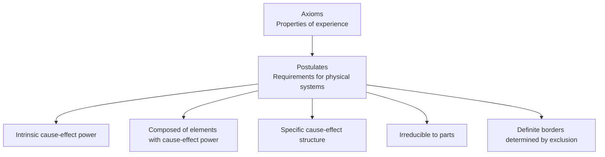
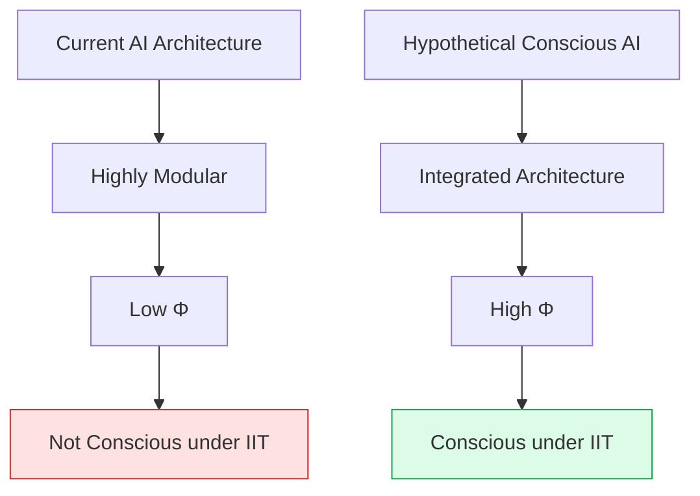

import { Card, CardGrid, Aside } from '@astrojs/starlight/components';
import Quiz from '@/components/Quiz';
import PhiExplorer from '@/components/PhiExplorer';

## The Core Idea

[Integrated Information Theory (IIT)](https://doi.org/10.1186/1471-2202-5-42), developed by neuroscientist Giulio Tononi, makes a bold claim: **consciousness is identical to integrated information**.

Rather than asking "what are the neural correlates of consciousness?" IIT starts from consciousness itself and asks: what must any conscious experience be like? From this analysis, it concludes that consciousness exists wherever there is a system with high **integrated information** (symbolized as **Φ**, pronounced "phi").

<Aside type="tip" title="Key Intuition">
A system is conscious when its whole is genuinely greater than the sum of its parts—when the parts work together to create something that couldn't exist if you split the system in two.
</Aside>

## The Five Axioms

IIT begins with five axioms—properties that are self-evidently true of any conscious experience:

<CardGrid>
  <Card title="1. Intrinsic Existence" icon="star">
    Experience exists from its own intrinsic perspective, not relative to an external observer.
  </Card>
  <Card title="2. Composition" icon="puzzle">
    Experience is structured—it's composed of distinctions (this, not that) and relations.
  </Card>
  <Card title="3. Information" icon="document">
    Experience is specific—this particular experience, different from all others.
  </Card>
  <Card title="4. Integration" icon="seti:pipeline">
    Experience is unified—it cannot be reduced to independent components.
  </Card>
  <Card title="5. Exclusion" icon="seti:lock">
    Experience is definite—it has a specific content and borders.
  </Card>
</CardGrid>

## From Axioms to Postulates

IIT derives requirements for any physical system that has consciousness:

The key postulate is **integration**: a conscious system must be irreducible to its parts. This is measured by **Φ** (phi)—how much the system's [cause-effect power](https://doi.org/10.1371/journal.pcbi.1003588) would be lost by any partition.

## Understanding Phi (Φ)

Phi measures **integrated information**: the difference between a whole system and its parts.

- **High Φ**: The whole has much more cause-effect power than its parts. Consciousness is present.
- **Low Φ**: The system can be divided without much loss. Little or no consciousness.
- **Φ = 0**: The system can be perfectly split. No consciousness.

### Interactive Exploration

Use this tool to build intuition for how integration affects phi:

<PhiExplorer client:load initialNodes={4} initialConnectivity={50} />

Notice:
- With no connections, the system has no integration (low Φ)
- With full connections, there's redundancy, reducing differentiation
- Peak Φ occurs at moderate connectivity—integration without redundancy

<Aside type="note" title="Simplification">
This is a pedagogical simplification. Real Φ calculation involves complex mathematics and is computationally intractable for systems larger than ~12 elements.
</Aside>

## Key Implications

### The Exclusion Postulate

Only the system with *maximum* Φ is conscious. This has surprising implications:

- Your whole brain might be one integrated conscious entity
- Individual neurons aren't separately conscious (their Φ is dominated by larger systems)
- No "combination problem" of how micro-experiences combine

### Consciousness Is Graded

IIT implies consciousness comes in degrees. A human might have Φ = 100, a mouse Φ = 10, and a thermostat Φ ≈ 0. There's no sharp line between conscious and non-conscious.

### Structure Determines Experience

The specific content of experience corresponds to the specific cause-effect structure. Two systems with identical Φ structures would have identical experiences.

## Strengths

| Strength | Explanation |
|----------|-------------|
| **Mathematically precise** | Φ can (in principle) be calculated, making predictions testable |
| **Explains integration** | Naturally accounts for the unity of consciousness |
| **Substrate-independent** | Consciousness depends on information structure, not specific material |
| **Addresses quality** | The theory attempts to explain *what* experiences are like, not just that they occur |

## Criticisms

<Card title="Computational intractability">
Computing Φ is [NP-hard](https://doi.org/10.1371/journal.pcbi.1004286)—infeasible for any realistic system. This limits empirical testing.
</Card>

<Card title="Unintuitive predictions">
IIT implies simple systems (like a photodiode array) might be conscious if highly integrated. Is a grid conscious?
</Card>

<Card title="The explanatory gap">
Critics argue IIT doesn't actually explain *why* integrated information = experience. It identifies a correlation, not a mechanism.
</Card>

<Card title="Functionalism challenges">
IIT is anti-functionalist—the same function implemented differently could have different Φ. This contradicts common intuitions about AI.
</Card>

## Implications for AI

IIT has **skeptical implications for digital AI**:

### Why Current AI May Not Be Conscious

1. **Modular architecture**: Digital computers are highly modular, which tends to reduce Φ
2. **Feed-forward processing**: Many AI systems process information in one direction without the integration IIT requires
3. **Simulation vs. Reality**: Simulating a high-Φ system doesn't create a high-Φ system (like simulating a storm doesn't make you wet)

### What AI Would Need

For AI to be conscious under IIT:
- **Integrated hardware**: Components that truly work as a unified whole
- **Cause-effect structure**: Real causal relationships, not just correlation
- **Non-modular design**: Can't be cleanly split into independent parts

<Aside type="caution" title="Tononi's View">
Giulio Tononi has explicitly argued that digital computers, including neural networks running on them, are not conscious under IIT—regardless of how sophisticated their behavior becomes.
</Aside>

## Test Your Understanding

<Quiz
  client:load
  title="IIT Quiz"
  questions={[
    {
      question: "According to IIT, a perfect software simulation of a brain running on a standard computer would:",
      options: [
        "Be conscious because it processes the same information",
        "Be conscious because it produces identical behavior",
        "Not be conscious because the simulation's Φ is that of the computer, not the simulated brain",
        "Not be conscious because software can't run fast enough"
      ],
      correctIndex: 2,
      explanation: "IIT is anti-functionalist: the physical substrate matters. A simulation reproduces the function but not the causal structure. The simulation's Φ is determined by the computer's modular architecture (low Φ), not what's being simulated. This is why Tononi argues simulations don't produce consciousness."
    },
    {
      question: "IIT implies that a simple photodiode array with highly integrated connections could have:",
      options: [
        "No consciousness, because it lacks neurons",
        "No consciousness, because it can't behave intelligently",
        "Some degree of consciousness if it has non-zero Φ, regardless of simplicity",
        "Human-level consciousness if the array is large enough"
      ],
      correctIndex: 2,
      explanation: "This is one of IIT's 'unintuitive predictions.' If a system has high Φ (information integration that's irreducible), it's conscious—even if simple and lacking intelligent behavior. IIT accepts this: consciousness is about integration, not complexity or intelligence per se. Critics find this counterintuitive."
    },
    {
      question: "The exclusion postulate in IIT addresses the 'combination problem' by claiming:",
      options: [
        "Micro-experiences combine into macro-experiences through a mysterious process",
        "Only the system with maximum Φ exists as a conscious entity; subsystems don't have separate consciousness",
        "All systems, from atoms to brains, are separately conscious",
        "Consciousness cannot be graded—either you're fully conscious or not at all"
      ],
      correctIndex: 1,
      explanation: "The combination problem asks how small experiences combine into larger ones. IIT's exclusion postulate sidesteps this: only the maximally irreducible system is conscious. Your neurons aren't each separately conscious—only the whole integrated system is. This avoids 'counting' multiple overlapping consciousnesses."
    },
    {
      question: "A critic of IIT might argue that identifying Φ with consciousness:",
      options: [
        "Solves the hard problem by explaining why integrated information feels like something",
        "Identifies a correlation without explaining why high Φ produces subjective experience",
        "Makes consciousness too easy to achieve in simple systems",
        "Is unfalsifiable because Φ cannot be calculated"
      ],
      correctIndex: 1,
      explanation: "Critics argue IIT identifies consciousness with Φ but doesn't explain WHY integrated information should feel like anything. It's like saying 'consciousness = integrated information' without bridging the explanatory gap. This relocates rather than solves the hard problem—we still need to explain why Φ produces experience."
    }
  ]}
/>

## Next Steps

IIT offers a mathematical approach focused on information integration. Next, explore [Global Workspace Theory](/theories/03-global-workspace/)—a cognitive theory that sees consciousness as global information broadcast.
