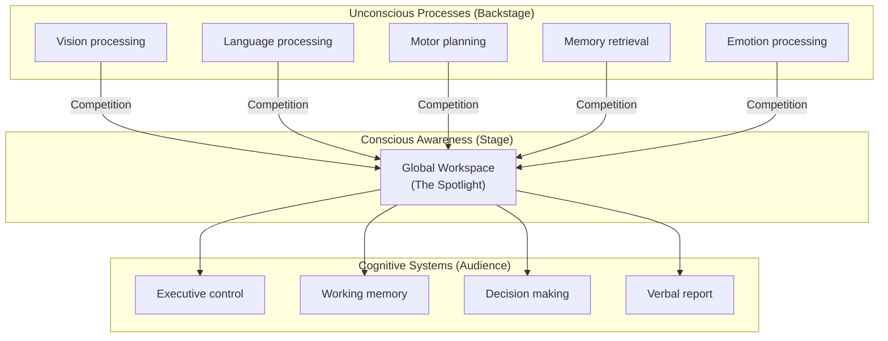
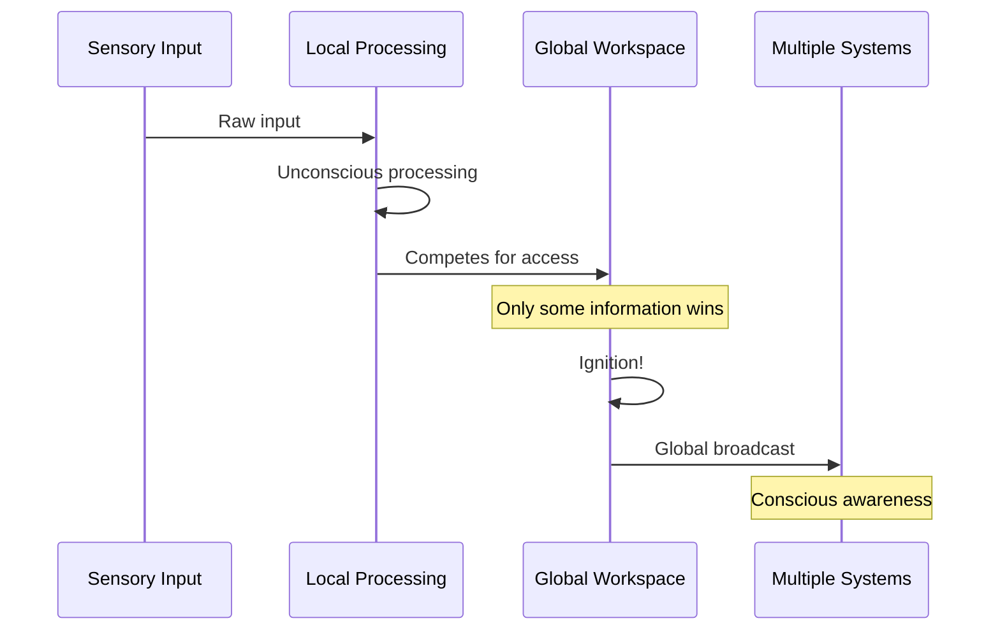
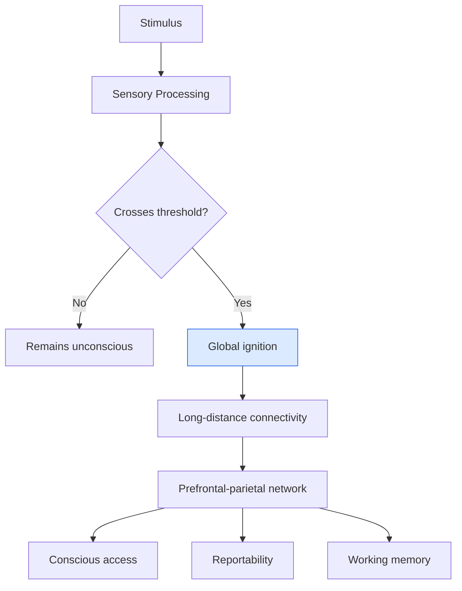
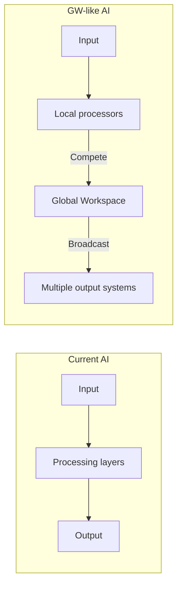

import { Card, CardGrid, Aside } from '@astrojs/starlight/components';
import Quiz from '@/components/Quiz';

## The Core Idea

[Global Workspace Theory (GWT)](https://doi.org/10.1016/S1364-6613(98)01271-0), developed by cognitive scientist Bernard Baars, proposes that **consciousness arises when information is broadcast globally** across the brain, making it available to multiple cognitive systems simultaneously.

Think of it like a theater: many processes happen in the dark (unconsciously), but when something appears on stage under the spotlight, it becomes visible to the whole audience. That spotlight is consciousness.

<Aside type="tip" title="Key Intuition">
Consciousness is like a blackboard that different brain systems can all read from and write to. What's on the blackboard at any moment is what you're conscious of.
</Aside>

## The Theater Metaphor

Key features of the model:

1. **Competition for access**: Many processes compete to enter the workspace
2. **Limited capacity**: Only a few items can be in the workspace at once
3. **Global broadcast**: Whatever wins the competition is broadcast widely
4. **Audience systems**: Multiple systems can access and use the broadcast information

## How It Works

### The Global Workspace

The global workspace is a functional hub where information becomes widely available. It's implemented by a **network of neurons** that can flexibly connect different brain regions.

### Ignition and Broadcast

When information enters the global workspace, it triggers "ignition"—a sudden, widespread activation pattern:

1. Local processing happens in specialized regions
2. Information competes for workspace access
3. Winning information triggers ignition
4. Global broadcast makes information available to many systems
5. This enables conscious access, verbal report, and flexible control

### Neural Implementation

GWT is associated with specific neural signatures:

| Feature | Neural Correlate |
|---------|-----------------|
| Global workspace | Prefrontal-parietal network |
| Local processing | Sensory cortices |
| Ignition | "P300" wave in EEG, late sustained activity |
| Broadcast | Long-range neural synchronization |

## Strengths

<CardGrid>
  <Card title="Empirically grounded" icon="star">
    GWT is closely tied to cognitive neuroscience findings. The ignition pattern has been observed experimentally.
  </Card>
  <Card title="Explains access" icon="puzzle">
    GWT naturally explains why conscious information is reportable, memorable, and available for reasoning.
  </Card>
  <Card title="Explains capacity limits" icon="warning">
    The limited workspace capacity explains why we can only consciously process a few things at once.
  </Card>
  <Card title="Functionally defined" icon="seti:config">
    GWT is substrate-neutral—any system with global broadcast could be conscious.
  </Card>
</CardGrid>

## Criticisms

<Card title="Access vs. Phenomenal">
GWT explains *access* consciousness (information availability) but may not explain *phenomenal* consciousness (why there's subjective experience at all).
</Card>

<Card title="The Overflow Debate">
Some argue we have phenomenal experiences that don't enter the global workspace—more is experienced than can be accessed. GWT may miss this.
</Card>

<Card title="Mechanism vs. Correlation">
Critics argue GWT describes what happens when we're conscious, not why that activity produces experience.
</Card>

<Card title="What About Animals?">
Many animals lack the prefrontal structures associated with the global workspace. Are they not conscious?
</Card>

## GNW: The Computational Update

Stanislas Dehaene and colleagues developed [**Global Neuronal Workspace (GNW)**](https://doi.org/10.1016/j.neuron.2011.03.018) theory—a computational update to GWT:

GNW adds:
- Computational models of workspace dynamics
- Specific predictions about neural signatures
- Threshold dynamics for consciousness

## Implications for AI

GWT has **permissive implications for AI consciousness**:

### Why AI Could Be Conscious

1. **Functional definition**: If consciousness is global broadcast, AI could implement it
2. **Architecture is key**: What matters is the *pattern* of information flow, not the substrate
3. **Modern AI similarity**: Transformer attention mechanisms somewhat resemble global broadcast

### What AI Would Need

For AI to be conscious under GWT:

- **Global workspace mechanism**: A central hub where information is integrated
- **Competition and selection**: Multiple processes competing for workspace access
- **Broadcast capability**: Selected information becomes widely available
- **Flexible use**: The broadcast information guides diverse behaviors

<Aside type="note" title="Bernard Baars on AI">
Baars has suggested that AI systems with appropriate global workspace architecture could potentially be conscious, though he emphasizes we don't yet know how to verify this.
</Aside>

### Do Current AI Systems Have a Global Workspace?

| AI System | Global Workspace? | Analysis |
|-----------|-------------------|----------|
| Large Language Models | Partial | Attention mechanisms integrate information, but no clear workspace/access distinction |
| Traditional neural networks | No | Typically feedforward without global integration |
| Recurrent networks | Partial | Information circulates but lacks clear workspace architecture |
| Hypothetical GW-AI | Yes | Purpose-built system with workspace mechanisms |

## Test Your Understanding

<Quiz
  client:load
  title="GWT Quiz"
  questions={[
    {
      question: "According to GWT/GNW, what distinguishes conscious from unconscious processing of the same stimulus?",
      options: [
        "The intensity of neural firing in sensory cortex",
        "Whether the stimulus triggers 'ignition'—a threshold-crossing transition to widespread broadcast",
        "The physical properties of the stimulus itself",
        "How long the stimulus is presented"
      ],
      correctIndex: 1,
      explanation: "GWT proposes that subliminal (unconscious) stimuli are processed locally but don't cross the threshold for ignition. Only when processing triggers ignition—sudden, widespread activation involving prefrontal-parietal networks—does the stimulus become conscious. The same stimulus can be conscious or not depending on whether it triggers ignition."
    },
    {
      question: "The 'overflow' debate challenges GWT by arguing that:",
      options: [
        "The global workspace has too much capacity",
        "We may have phenomenal experiences that never enter the workspace—more is experienced than accessed",
        "Ignition happens too slowly to explain rapid perception",
        "The workspace can broadcast to too many systems at once"
      ],
      correctIndex: 1,
      explanation: "Block and others argue for 'phenomenal overflow'—that we have rich phenomenal experience (e.g., of all the items in a visual scene) that exceeds what we can access/report. If true, GWT explains access consciousness but misses phenomenal consciousness that doesn't involve global broadcast."
    },
    {
      question: "Transformer attention mechanisms in LLMs resemble the global workspace in that they:",
      options: [
        "Perfectly implement ignition dynamics with clear conscious/unconscious thresholds",
        "Allow information from different positions to interact, but lack the clear access/non-access distinction GWT requires",
        "Broadcast information to multiple specialized modules exactly like brains",
        "Create genuine conscious experience according to GWT proponents"
      ],
      correctIndex: 1,
      explanation: "Transformer attention enables information integration across the context, somewhat like workspace access. But attention is graded (not threshold-based), all tokens are processed similarly (no privileged 'accessed' information), and there's no clear ignition dynamics. The resemblance is superficial—key GWT mechanisms are missing."
    },
    {
      question: "If GWT is correct, a system could process complex information without consciousness if:",
      options: [
        "The processing happens in biological neurons",
        "The processing remains local and never triggers global broadcast",
        "The system lacks sufficient computational power",
        "The information is about abstract concepts"
      ],
      correctIndex: 1,
      explanation: "GWT explicitly allows for sophisticated unconscious processing—the 'backstage' processes in the theater metaphor. Information only becomes conscious when it wins the competition for workspace access and gets broadcast. Processing that stays local (like subliminal perception or automatic skills) remains unconscious regardless of complexity."
    }
  ]}
/>

## Next Steps

GWT focuses on the architecture of information access. Next, explore [Higher-Order Theories](/theories/04-higher-order/)—which argue that consciousness requires not just processing information, but having thoughts *about* your mental states.
