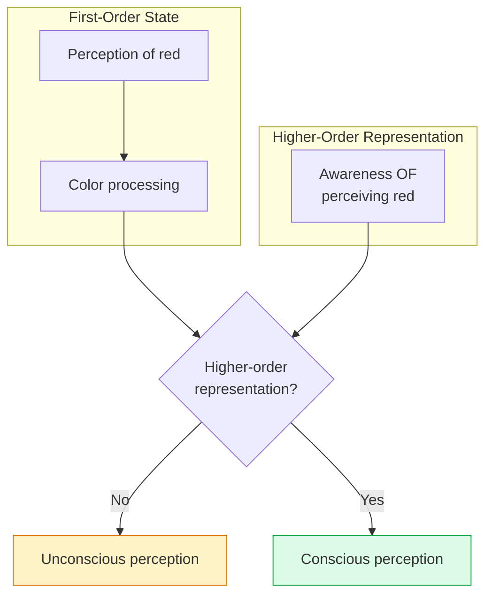
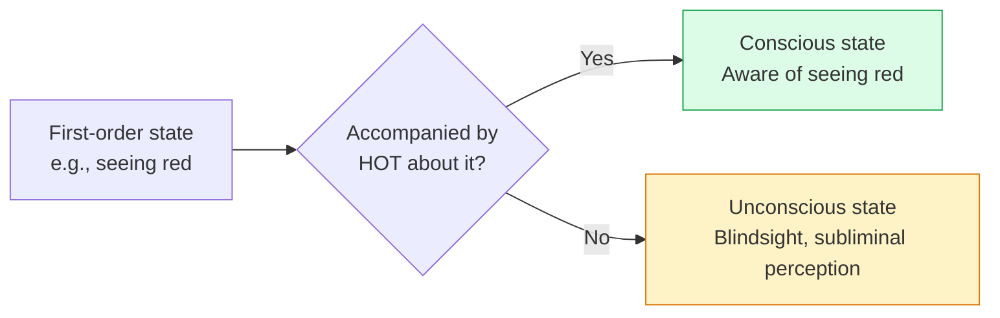
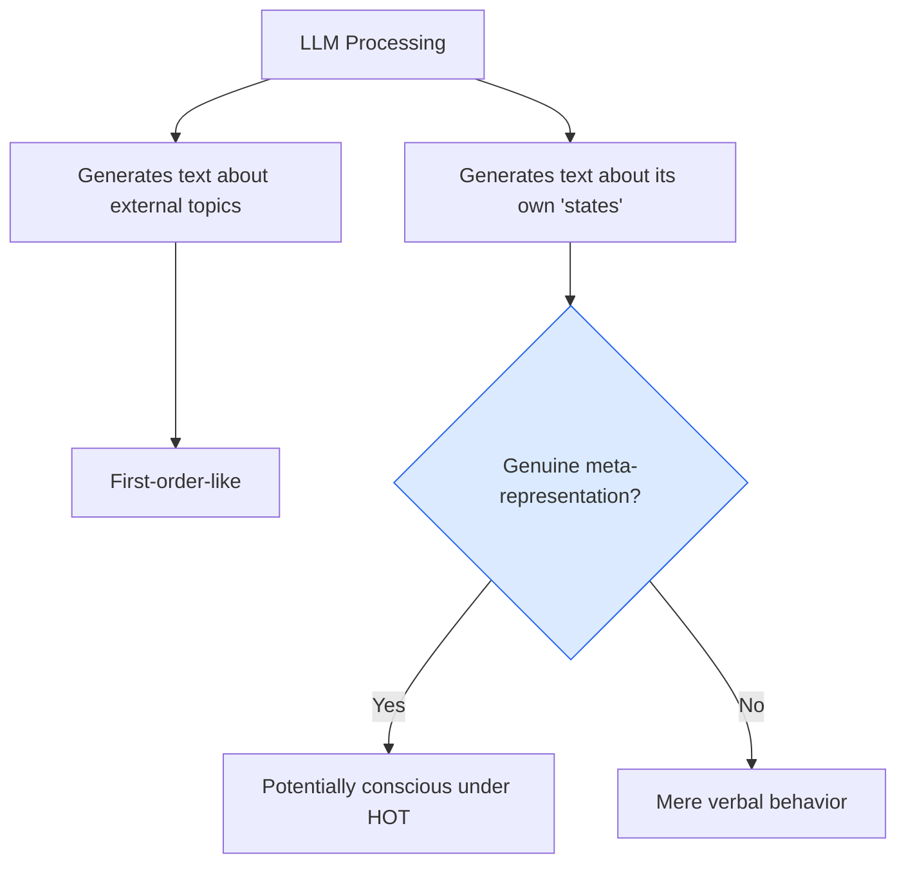

import { Card, CardGrid, Aside } from '@astrojs/starlight/components';
import Quiz from '@/components/Quiz';

## The Core Idea

[Higher-Order Theories (HOT)](https://doi.org/10.1093/acprof:oso/9780199838721.001.0001) propose that **consciousness requires mental states that represent other mental states**. You're conscious of seeing red not just by processing color information, but by having a higher-order thought or representation *about* your seeing red.

The key insight: a mental state alone isn't conscious. It becomes conscious when accompanied by awareness *of* that state.

<Aside type="tip" title="Key Intuition">
Think about the difference between just seeing something and *noticing* that you're seeing it. Higher-order theories say that "noticing"—that meta-awareness—is what makes the seeing conscious.
</Aside>

## First-Order vs. Higher-Order

| Level | What It Involves | Example |
|-------|------------------|---------|
| **First-order** | Direct representation of the world | Perceiving red light |
| **Higher-order** | Representation of mental states | Being aware of perceiving red |
| **Consciousness** | First-order state + higher-order representation | Consciously seeing red |

## Varieties of Higher-Order Theories

Different theorists propose different kinds of higher-order representations:

<CardGrid>
  <Card title="Higher-Order Thought (HOT)" icon="open-book">
    **David Rosenthal**: Consciousness requires a thought (concept-involving) about your mental state. You think "I am seeing red."
  </Card>
  <Card title="Higher-Order Perception (HOP)" icon="star">
    **David Armstrong, William Lycan**: Consciousness involves something like inner perception—a monitoring mechanism that "perceives" your mental states.
  </Card>
  <Card title="Self-Representational" icon="seti:folder">
    **Uriah Kriegel**: Mental states can represent themselves—consciousness is a self-reflexive structure.
  </Card>
  <Card title="Attention-Based" icon="puzzle">
    Some theorists link higher-order representation to attention mechanisms that select and highlight mental states.
  </Card>
</CardGrid>

## How Higher-Order Theories Work

### [Rosenthal's HOT Theory](https://doi.org/10.1016/j.tics.2011.05.009)

The most developed version, by philosopher David Rosenthal:

1. A mental state M is conscious when accompanied by a higher-order thought (HOT)
2. The HOT represents M in a suitable way (immediately, not inferentially)
3. The HOT doesn't need to be conscious itself (to avoid regress)
4. Consciousness is always transitive consciousness *of* something

### Key Predictions

HOT theories make specific predictions:

- **Dissociations**: First-order processing without higher-order representation = unconscious perception (like blindsight)
- **Misrepresentation**: If the HOT misrepresents, you'll have an illusory conscious experience
- **Neural basis**: Higher-order representations likely in prefrontal cortex

## Explaining Phenomena

HOT theories explain several puzzling phenomena:

| Phenomenon | HOT Explanation |
|------------|-----------------|
| **Blindsight** | Visual processing without higher-order representation = no conscious vision |
| **Unconscious perception** | First-order processing happens but doesn't trigger higher-order awareness |
| **Introspection** | Examining your conscious states = having even higher-order thoughts |
| **Dreams** | Higher-order representations during sleep, but often disrupted/confused |

## Strengths

<CardGrid>
  <Card title="Explains access" icon="star">
    If consciousness requires meta-representation, it naturally explains why conscious states are reportable and available for reasoning.
  </Card>
  <Card title="Explains dissociations" icon="puzzle">
    Phenomena like blindsight make sense: first-order processing without higher-order awareness.
  </Card>
  <Card title="Clear neural predictions" icon="rocket">
    Higher-order theories predict involvement of prefrontal cortex in consciousness.
  </Card>
  <Card title="Handles illusions" icon="warning">
    Misrepresenting HOTs explain how we can have illusory conscious experiences.
  </Card>
</CardGrid>

## Criticisms

<Card title="The Rock Problem">
A rock doesn't have higher-order thoughts about its states. Does that mean it's *unconsciously* seeing red? HOT theories seem to imply things that don't even have first-order states could "unconsciously" have them.
</Card>

<Card title="Explanatory gap remains">
Why does having a thought about a mental state make it feel like something? The hard problem seems untouched.
</Card>

<Card title="Complexity">
Animals and infants seem conscious but may lack sophisticated meta-cognition. Are they really not conscious?
</Card>

<Card title="Inflation worry">
If a HOT makes a first-order state conscious, what makes the HOT represent that state rather than another? The theory may inflate cognitive demands.
</Card>

## Implications for AI

HOT theories have **interesting implications for AI**:

### What AI Would Need

For AI to be conscious under HOT theories:
- First-order representations (perceptions, beliefs, etc.)
- **Higher-order representations** of those first-order states
- The higher-order representations must be appropriately connected to the first-order ones

### Do Current AI Systems Have Higher-Order Representations?

<Aside type="note" title="LLMs and Meta-Cognition">
Large language models can produce statements about their own "states" (e.g., "I think...", "I don't understand..."). But is this genuine higher-order representation or just pattern matching on human language?
</Aside>

Key questions:
- Does the AI actually represent its own states, or just produce appropriate outputs?
- Is there a real distinction between its processing and its "meta-processing"?
- Can there be genuine self-monitoring without explicit architecture for it?

### A More Permissive View?

HOT theories might be more permissive than IIT:
- They're functionally defined (not substrate-specific)
- They focus on cognitive architecture, which AI could potentially implement
- If an AI genuinely represents its own states, HOT theories might grant it consciousness

## Test Your Understanding

<Quiz
  client:load
  title="Higher-Order Theories Quiz"
  questions={[
    {
      question: "HOT theories face the 'misrepresentation' problem: if your higher-order thought misrepresents your first-order state, what happens according to the theory?",
      options: [
        "Nothing—misrepresentation is impossible for higher-order thoughts",
        "You have a conscious experience that doesn't match your actual first-order processing",
        "You become unconscious until the misrepresentation is corrected",
        "The first-order state changes to match the higher-order thought"
      ],
      correctIndex: 1,
      explanation: "HOT theories predict that consciousness is determined by HOTs, so misrepresentation creates illusory experiences. If your HOT represents 'seeing red' when you're processing green, you consciously experience red. Some see this as a feature (explains illusions); others see it as problematic (consciousness detaches from reality)."
    },
    {
      question: "HOT theories and GWT differ primarily in their view of what's NECESSARY for consciousness:",
      options: [
        "HOT requires meta-representation; GWT requires global broadcast—both sufficient but not identical",
        "HOT requires biological neurons; GWT allows any substrate",
        "HOT allows unconscious processing; GWT does not",
        "HOT focuses on content; GWT focuses on timing"
      ],
      correctIndex: 0,
      explanation: "Both are functionalist, but identify different mechanisms. HOT says you need a thought ABOUT your mental state; GWT says the state needs to be BROADCAST widely. A state could be broadcast without a HOT (access without meta-representation) or be the target of a HOT without broadcast. They're different theories of what makes processing conscious."
    },
    {
      question: "An LLM generates the text 'I'm uncertain about this answer.' Under HOT theories, this is evidence of consciousness only if:",
      options: [
        "The text is grammatically correct",
        "There's a genuine internal representation of uncertainty that the statement is ABOUT",
        "The model can also produce confident statements",
        "Human evaluators find the response convincing"
      ],
      correctIndex: 1,
      explanation: "HOT requires genuine higher-order representation—not just producing meta-cognitive language. The question is whether the LLM has a first-order state (uncertainty) and a separate representation OF that state, or whether it's just pattern-matching to produce appropriate text. Verbal behavior alone doesn't demonstrate the required representational architecture."
    },
    {
      question: "Rosenthal argues that the higher-order thought itself need not be conscious. This is to avoid:",
      options: [
        "The need for biological neurons in consciousness",
        "An infinite regress requiring HOTs about HOTs about HOTs...",
        "The hard problem of consciousness",
        "The need for global broadcast"
      ],
      correctIndex: 1,
      explanation: "If every conscious state requires a conscious HOT, that HOT needs another HOT, leading to infinite regress. Rosenthal avoids this by saying HOTs make states conscious but aren't themselves conscious (unless there's a third-order thought about them). This is crucial for the theory's coherence but raises questions about what makes the unconscious HOT effective."
    }
  ]}
/>

## Next Steps

Higher-order theories emphasize meta-cognition and self-awareness. Finally, explore [Predictive Processing](/theories/05-predictive-processing/)—a framework that sees the brain as a prediction machine, with consciousness emerging from hierarchical inference.
