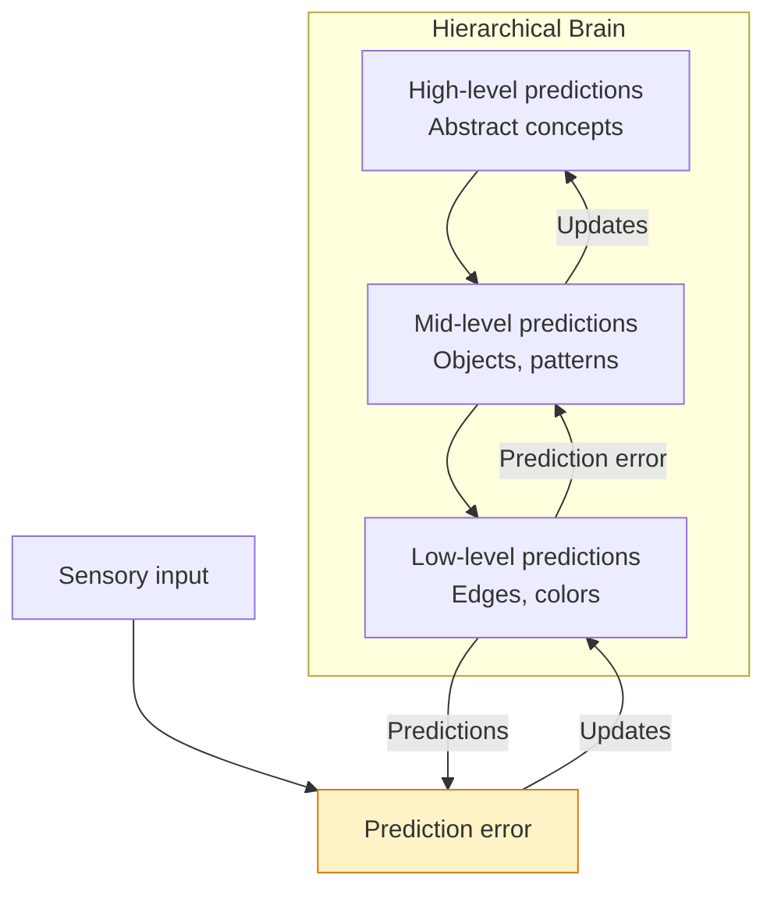
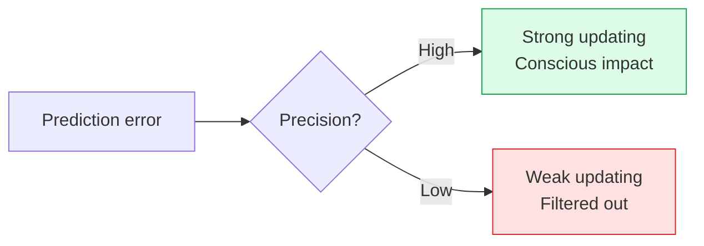
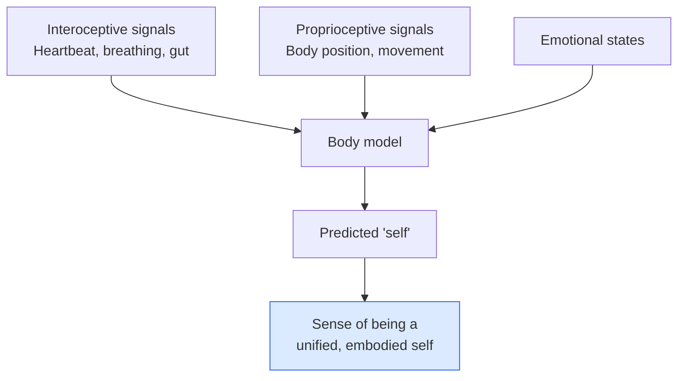
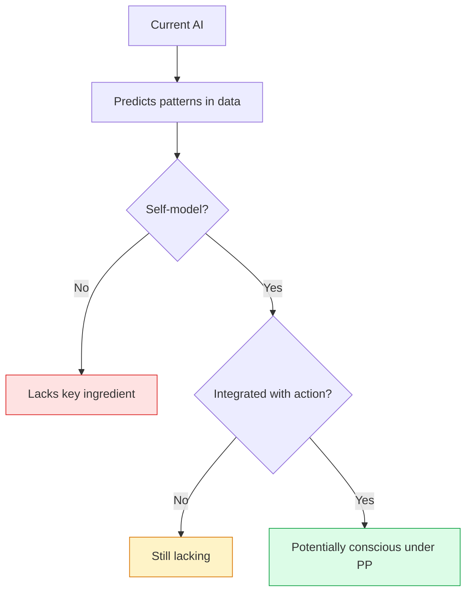

import { Card, CardGrid, Aside } from '@astrojs/starlight/components';
import Quiz from '@/components/Quiz';

## The Core Idea

[Predictive Processing (PP)](https://doi.org/10.1017/S0140525X12000477) proposes that the brain is fundamentally a **prediction machine**. Rather than passively receiving sensory input, the brain actively generates predictions about what it expects to perceive, then updates based on prediction errors.

Consciousness, in this view, emerges from the brain's best guess about the causes of its sensory input—including its model of itself.

<Aside type="tip" title="Key Intuition">
You don't see the world directly. You see your brain's best hypothesis about what's causing your sensory signals. Perception is "controlled hallucination."
</Aside>

## The Predictive Architecture

Key components:
1. **Generative model**: The brain maintains a model that generates predictions
2. **Prediction errors**: Mismatches between predictions and input
3. **Hierarchical processing**: Predictions flow down, errors flow up
4. **Precision weighting**: Not all errors are weighted equally

## How Prediction Creates Perception

### The Bayesian Brain

PP is often framed in Bayesian terms:

| Component | Bayesian Interpretation |
|-----------|------------------------|
| **Prior** | The brain's predictions before new input |
| **Likelihood** | How well the input matches different hypotheses |
| **Posterior** | The updated belief after combining prior and likelihood |
| **Perception** | The posterior—your brain's best guess |

Your conscious experience is the posterior: the brain's best hypothesis about what's out there, given both predictions and sensory evidence.

### Precision Weighting

Not all prediction errors are equal. The brain assigns **precision** (confidence) to predictions and errors:

- **High-precision errors**: Get more weight, drive more updating
- **Low-precision errors**: Get ignored (treated as noise)
- **Attention**: Can be understood as precision optimization

## Consciousness in PP

Different PP theorists have different views on how consciousness fits in:

<CardGrid>
  <Card title="Attention and Precision" icon="star">
    **Hohwy, Clark**: Consciousness arises from precision-weighted prediction. What we're conscious of is what has high-precision expectations.
  </Card>
  <Card title="Self-Modeling" icon="seti:folder">
    **Seth**: Consciousness emerges from the brain's predictive model of itself—including its bodily states (interoception).
  </Card>
  <Card title="Active Inference" icon="rocket">
    **[Friston](https://doi.org/10.1038/nrn2787)**: Consciousness relates to active inference—the brain minimizes prediction error by both updating beliefs AND acting on the world.
  </Card>
  <Card title="Global Predictions" icon="seti:broadcast">
    Some combine PP with GWT: consciousness is when predictions are globally broadcast.
  </Card>
</CardGrid>

## [Anil Seth's "Beast Machine" View](https://www.anilseth.com/being-you/)

Neuroscientist Anil Seth has developed an influential PP account of consciousness:

### The Controlled Hallucination

"We're all hallucinating all the time. When we agree about our hallucinations, we call that reality."

- Perception is the brain's "best guess" constrained by sensory signals
- Without constraints, you get dreams and hallucinations
- The world we experience is a model, not the world itself

### The Self as Prediction

Seth emphasizes that the self is also a prediction:

This approach explains:
- Why consciousness feels "embodied"
- Why emotions feel like they come from inside
- How disorders of self-experience might arise

## Strengths

<CardGrid>
  <Card title="Unifying framework" icon="puzzle">
    PP unifies perception, action, learning, and attention under one principle.
  </Card>
  <Card title="Explains illusions" icon="star">
    Visual illusions are cases where priors override (weak) sensory evidence.
  </Card>
  <Card title="Computational precision" icon="document">
    PP is mathematically precise and can be implemented in simulations.
  </Card>
  <Card title="Handles embodiment" icon="heart">
    The self-model account explains why consciousness feels embodied.
  </Card>
</CardGrid>

## Criticisms

<Card title="Too broad?">
If everything the brain does is prediction error minimization, does PP really explain consciousness specifically? What distinguishes conscious from unconscious prediction?
</Card>

<Card title="Hard problem remains">
Why does having a self-model *feel like something*? PP describes mechanisms but may not explain phenomenal consciousness.
</Card>

<Card title="Testability">
PP is sometimes criticized for being unfalsifiable—any result can be explained by adjusting priors or precision.
</Card>

<Card title="Phenomenological fit">
Does experience really feel like "controlled hallucination"? Critics argue this doesn't match how we actually experience the world.
</Card>

## Implications for AI

PP has **permissive implications for AI consciousness**:

### Modern AI as Predictive Processing

Current AI systems already implement prediction:

| AI System | Predictive Element |
|-----------|-------------------|
| **GPT/LLMs** | Predict next token based on context |
| **VAEs** | Learn generative models of data |
| **World models** | Predict future states from actions |
| **Active inference agents** | Minimize expected free energy |

<Aside type="note" title="Key Question">
If consciousness in humans emerges from predictive processing, and AI systems do predictive processing, could they be conscious? The critical question is whether they do the *right kind* of prediction.
</Aside>

### What AI Would Need

For AI to be conscious under PP:

1. **Hierarchical generative model**: Not just prediction, but structured, multi-level prediction
2. **Precision weighting**: Flexible attention that modulates prediction errors
3. **Self-model**: A model of itself as an agent in the world
4. **Active inference**: Not just passive prediction but action to minimize prediction error
5. **Integration**: These components working together in a unified system

### The Self-Model Question

Do AI systems model themselves?

- LLMs can talk about themselves, but do they have genuine self-models?
- Reinforcement learning agents model state-action relationships, but include a model of themselves as agents?
- Explicit self-models could be built, but would that be enough?

## Test Your Understanding

<Quiz
  client:load
  title="Predictive Processing Quiz"
  questions={[
    {
      question: "Under PP, visual illusions occur because:",
      options: [
        "The eyes are physically defective",
        "Strong priors override weak or ambiguous sensory evidence",
        "The brain fails to process the visual input",
        "Consciousness misinterprets what the eyes see"
      ],
      correctIndex: 1,
      explanation: "PP explains illusions as cases where priors (predictions based on past experience) are strong relative to sensory evidence. In the hollow mask illusion, for example, the prior that faces are convex is so strong it overrides the evidence of the concave surface. The brain 'sees' what it expects, not what's there."
    },
    {
      question: "Precision weighting in PP is closely related to attention because:",
      options: [
        "Both involve the prefrontal cortex",
        "Attention can be understood as increasing the precision (weight) of certain prediction errors",
        "Both are mechanisms unique to conscious processing",
        "Precision always follows where attention is directed"
      ],
      correctIndex: 1,
      explanation: "PP offers a novel account of attention: attending to something increases the precision (reliability weighting) of prediction errors from that source. High-precision errors have more influence on belief updating. This reframes attention not as a spotlight but as a gain control mechanism for prediction error channels."
    },
    {
      question: "A key difference between PP and GWT regarding consciousness is:",
      options: [
        "PP requires biological neurons; GWT does not",
        "PP emphasizes hierarchical self-modeling; GWT emphasizes information broadcast without requiring self-models",
        "GWT applies to vision; PP applies only to abstract thought",
        "PP predicts consciousness is binary; GWT predicts it's graded"
      ],
      correctIndex: 1,
      explanation: "PP ties consciousness to self-modeling within a predictive hierarchy—the brain's model of itself as an embodied agent. GWT focuses on whether information enters a global workspace and gets broadcast, without necessarily requiring the system to model itself. They emphasize different architectural features as central to consciousness."
    },
    {
      question: "Active inference extends PP by claiming that organisms minimize prediction error by:",
      options: [
        "Only updating their internal models when predictions fail",
        "Both updating beliefs AND acting on the world to make their predictions come true",
        "Ignoring prediction errors that are too large",
        "Predicting only what they can control"
      ],
      correctIndex: 1,
      explanation: "Active inference is bidirectional: you can minimize prediction error by changing your beliefs to fit the world (perception) OR by changing the world to fit your predictions (action). This elegantly unifies perception, action, and learning under one principle—the organism acts to make its predictions self-fulfilling."
    }
  ]}
/>

## Next Steps

You've now explored the four major theories of consciousness. Ready to see how they apply to AI? Head to [Can Machines Be Conscious?](/ai-consciousness/01-can-machines-be-conscious/) or [compare the theories](/comparisons/01-theory-comparison/) side by side.
