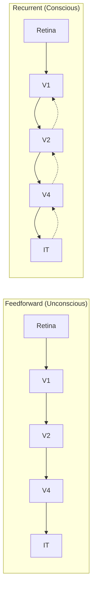
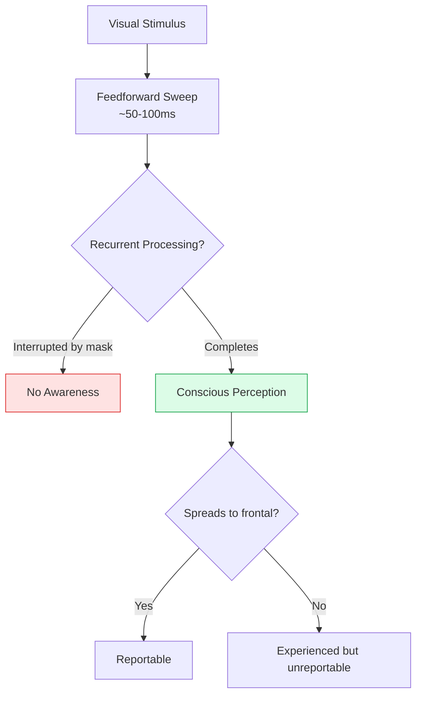
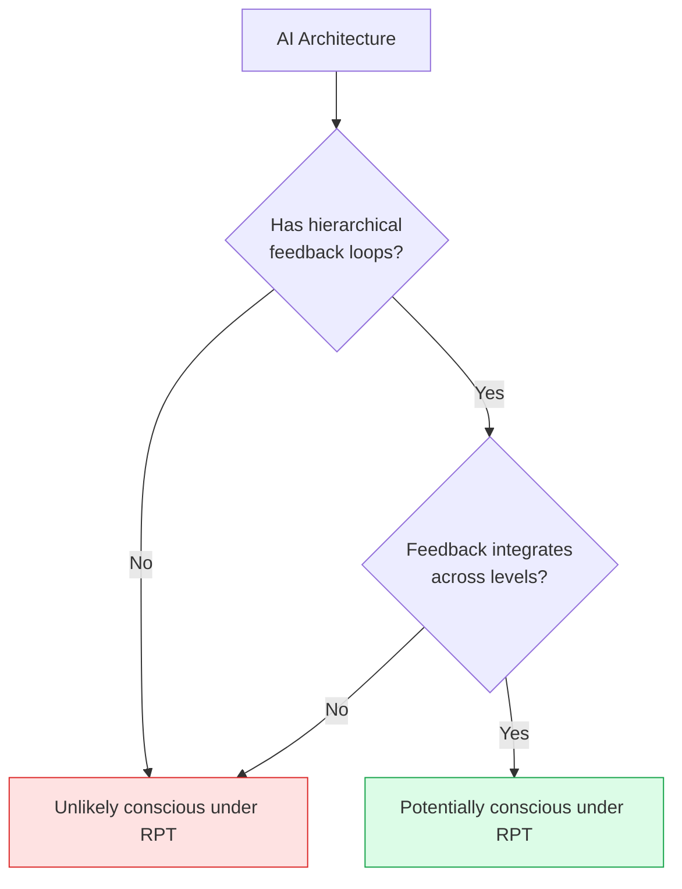

import { Card, CardGrid, Aside } from '@astrojs/starlight/components';
import Quiz from '@/components/Quiz';

## The Core Idea

[Recurrent Processing Theory (RPT)](https://doi.org/10.1016/j.tics.2006.09.007), developed primarily by neuroscientist **Victor Lamme**, proposes that consciousness arises from **recurrent (feedback) processing** in the brain—specifically when information flows backward through the sensory hierarchy, not just forward.

When you see something, information first travels *forward* from the retina through increasingly complex visual areas. But according to RPT, this initial "feedforward sweep" is unconscious. **Consciousness only emerges when information loops back**—when higher areas send signals back to lower areas, creating recurrent processing.

<Aside type="tip" title="Key Intuition">
Think of consciousness like a conversation: the feedforward sweep is like hearing someone speak, but you only become conscious of the meaning when your brain "talks back" to earlier processing stages, integrating and interpreting the information.
</Aside>

## Feedforward vs. Recurrent Processing

| Processing Type | Direction | Consciousness |
|----------------|-----------|---------------|
| **Feedforward** | Bottom-up only | Unconscious |
| **Local recurrent** | Feedback within areas | Phenomenal consciousness |
| **Global recurrent** | Widespread feedback | Access consciousness (reportable) |

## The Two Types of Consciousness in RPT

Lamme makes an important distinction that aligns with, but extends, the phenomenal/access consciousness distinction:

<CardGrid>
  <Card title="Phenomenal Consciousness" icon="star">
    Arises from **local recurrent processing** within sensory areas. You have experiences even if you can't report them. This is the "raw feel" of perception.

    **Neural basis**: Feedback connections within visual cortex (V1-V4-IT loops)
  </Card>
  <Card title="Access Consciousness" icon="seti:broadcast">
    Arises when recurrent processing **spreads to frontal/parietal areas**. This makes information globally available for report, reasoning, and action.

    **Neural basis**: Fronto-parietal connections to sensory cortex
  </Card>
</CardGrid>

<Aside type="note" title="Overflow Hypothesis">
Lamme argues there's more phenomenal consciousness than access consciousness—we experience more than we can report. This is the "overflow" hypothesis: phenomenal experience overflows cognitive access (Lamme, 2010).
</Aside>

## Evidence for RPT

### Backward Masking Studies

When a visual stimulus is quickly followed by a mask:
1. **Short delay**: You see the stimulus (recurrent processing completes)
2. **Long delay**: You see both separately
3. **Critical timing** (~100ms): Recurrent processing is interrupted, and you become *unaware* of the first stimulus—even though feedforward processing occurred

This suggests the mask [interrupts recurrent processing](https://doi.org/10.1016/S0166-2236(00)01657-X) before consciousness can arise.

### Neural Correlates

Studies show:
- Conscious perception correlates with activity in **feedback pathways**
- Unconscious processing involves only **feedforward activity**
- Disrupting feedback (e.g., with TMS) impairs conscious perception more than unconscious processing

### Subliminal Perception

Subliminal stimuli (below the threshold of awareness) still influence behavior, showing feedforward processing occurs without consciousness. But when stimuli become conscious, recurrent processing is always present (Dehaene et al., 2006).

## Strengths

| Strength | Explanation |
|----------|-------------|
| **Empirically grounded** | Based directly on neuroscience findings about visual processing |
| **Testable predictions** | Specific timing predictions about when consciousness emerges |
| **Explains dissociations** | Accounts for blindsight, subliminal perception, and masking effects |
| **Distinguishes phenomenal/access** | Provides neural mechanisms for both types of consciousness |
| **Computational precision** | Clear about what neural operations are involved |

## Criticisms

<Card title="Limited to vision">
RPT was developed primarily for visual consciousness. It's less clear how it extends to other modalities (audition, touch) or to more abstract thoughts.
</Card>

<Card title="The hard problem remains">
Even if recurrent processing correlates with consciousness, why does feedback *feel* like something? The theory identifies a mechanism but doesn't explain why it generates experience.
</Card>

<Card title="Phenomenal consciousness without access?">
Critics question whether we can meaningfully claim someone has phenomenal consciousness they can't report on. How would we know? (Cohen & Dennett, 2011).
</Card>

<Card title="Other functions of recurrence">
Recurrent processing serves many functions (prediction, attention, memory). What distinguishes conscious from unconscious recurrence?
</Card>

## Implications for AI

RPT has specific implications for machine consciousness:

### What AI Would Need

| Requirement | Explanation |
|-------------|-------------|
| **Hierarchical processing** | Multiple levels of feature extraction |
| **Feedback connections** | Higher layers must feed back to lower layers |
| **Temporal dynamics** | Processing must unfold over time with iterations |
| **Recurrent architecture** | Not just transformers' attention—true bidirectional flow |

### Current AI Assessment

<CardGrid>
  <Card title="Feedforward Networks" icon="warning">
    Standard deep neural networks are primarily feedforward—information flows in one direction. Under RPT, they lack the recurrent processing needed for consciousness.
  </Card>
  <Card title="Recurrent Neural Networks" icon="puzzle">
    RNNs and LSTMs have recurrence, but it's typically for temporal processing, not the hierarchical feedback RPT describes.
  </Card>
  <Card title="Predictive Coding Networks" icon="star">
    These implement top-down predictions and bottom-up error signals—closer to what RPT requires.
  </Card>
</CardGrid>

<Aside type="tip" title="AI Architectures to Watch">
Predictive coding networks, bidirectional transformers with iterative refinement, and neuromorphic systems with feedback connections are more aligned with RPT's requirements than standard feedforward networks.
</Aside>

## Relationship to Other Theories

| Theory | Relationship to RPT |
|--------|---------------------|
| **GWT** | Complementary: Global recurrence may implement the global workspace |
| **IIT** | Compatible: Recurrent loops create integrated information |
| **HOT** | Tension: RPT suggests phenomenal consciousness without higher-order thoughts |
| **PP** | Close alignment: Predictive processing involves hierarchical feedback |

## Test Your Understanding

<Quiz
  client:load
  title="RPT Quiz"
  questions={[
    {
      question: "In backward masking experiments, a stimulus shown for 30ms followed by a mask is often not consciously seen, while the same stimulus without a mask IS seen. RPT explains this by arguing:",
      options: [
        "The mask prevents the stimulus from reaching the retina",
        "The mask interrupts recurrent processing before it can complete, preventing consciousness",
        "The mask creates too much feedforward activity",
        "Consciousness requires stimuli to last at least 50ms"
      ],
      correctIndex: 1,
      explanation: "The mask doesn't prevent feedforward processing (which happens quickly). It interrupts the slower recurrent loops that RPT claims are necessary for consciousness. The stimulus is processed but not consciously perceived because the mask disrupts feedback before it completes the consciousness-generating loop."
    },
    {
      question: "RPT's distinction between local and global recurrent processing maps onto:",
      options: [
        "Fast vs. slow processing speed",
        "Phenomenal consciousness vs. access consciousness",
        "Conscious vs. unconscious processing",
        "Visual vs. auditory consciousness"
      ],
      correctIndex: 1,
      explanation: "Lamme argues local recurrent processing (within sensory cortex) creates phenomenal consciousness—you have the experience even if you can't report it. Global recurrence (spreading to frontal/parietal areas) creates access consciousness—now you can report and reason about the experience. This neural distinction maps onto Block's conceptual distinction."
    },
    {
      question: "A critic might argue that RPT faces the 'phenomenal consciousness without reportability' problem because:",
      options: [
        "Local recurrence isn't actually found in brains",
        "If you can't report an experience, how do we know it exists at all?",
        "Phenomenal consciousness is identical to access consciousness",
        "RPT predicts too much consciousness in simple systems"
      ],
      correctIndex: 1,
      explanation: "RPT claims local recurrence creates phenomenal experience that may not be reportable (lacking global recurrence). But critics like Dennett ask: if experience is unreportable, what evidence could support its existence? This challenges the methodological basis for claiming there's 'more' consciousness than we can access."
    },
    {
      question: "Standard transformer architectures differ from what RPT requires because:",
      options: [
        "Transformers are too slow to process information",
        "Transformers lack the hierarchical feedback loops where higher layers iteratively refine lower-layer representations",
        "Transformers don't process visual information",
        "Transformers have too many parameters"
      ],
      correctIndex: 1,
      explanation: "While transformers have attention (which creates some integration), they're largely feedforward—each layer processes and passes information to the next without true iterative refinement through feedback. RPT requires higher levels to send signals back to lower levels, refining representations through multiple iterations. This architecture is different from what transformers implement."
    }
  ]}
/>

## Next Steps

RPT focuses on the neural mechanisms of visual consciousness. For a theory that explains consciousness as the brain's model of its own attention, explore [Attention Schema Theory](/theories/07-attention-schema/).
