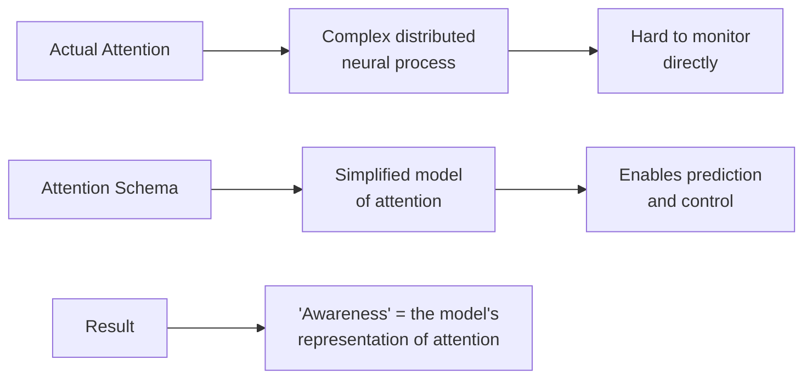
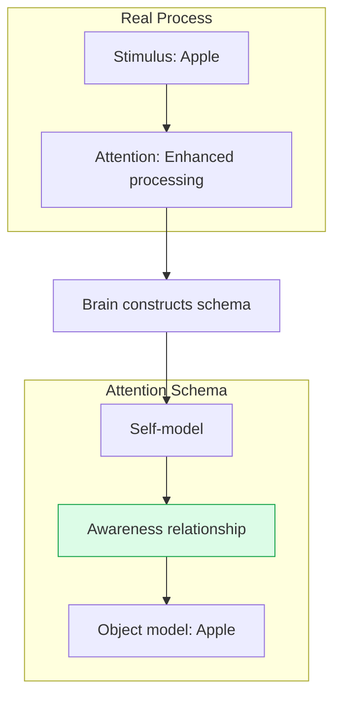
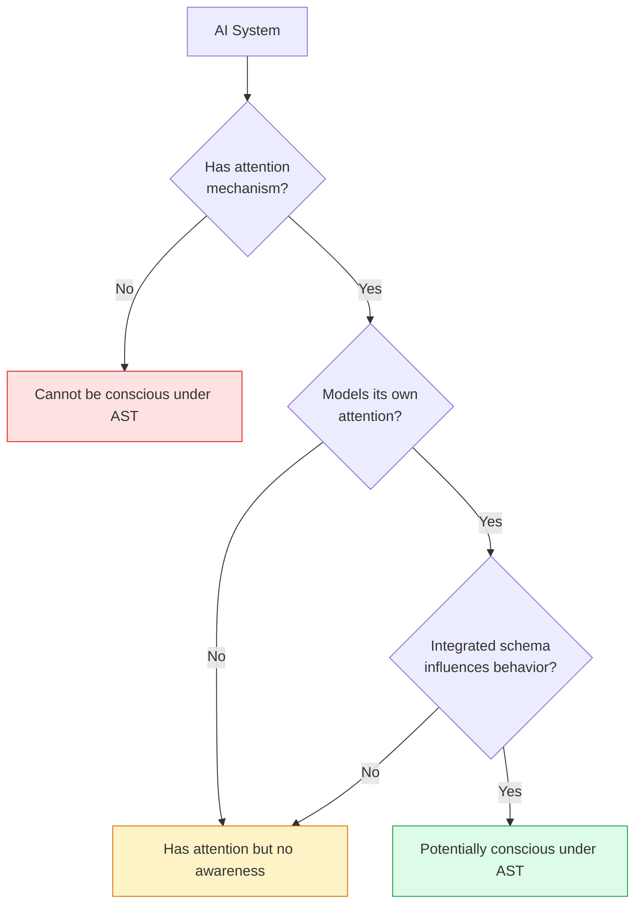

import { Card, CardGrid, Aside } from '@astrojs/starlight/components';
import Quiz from '@/components/Quiz';

## The Core Idea

[Attention Schema Theory (AST)](https://doi.org/10.3389/fnhum.2015.00500), developed by neuroscientist **Michael Graziano**, proposes a strikingly deflationary account of consciousness: **consciousness is the brain's internal model (schema) of its own attention**.

Just as the brain builds models of the body (body schema), other people's minds (theory of mind), and the physical world, it builds a model of its own attentional processes. This "attention schema" is a simplified, sometimes inaccurate representation of attention—and this model is what we call consciousness.

<Aside type="tip" title="Key Intuition">
You don't have direct access to how attention actually works in your brain. Instead, you have a *model* of attention—a useful fiction that helps you predict and control your own focus. That model, with its felt sense of "awareness," is consciousness.
</Aside>

## Why Does the Brain Model Attention?

Attention is a complex, distributed brain process. To control it effectively, the brain needs a simplified model:

### The Body Schema Analogy

Your brain has a *body schema*—an internal model of your body's position and movements. This schema:
- Is often inaccurate (phantom limbs, rubber hand illusion)
- Helps predict and control movement
- Feels real even when it's wrong

AST argues consciousness is similar: a schema that models attention, feels real, but is a construct.

## Key Claims of AST

<CardGrid>
  <Card title="Consciousness = Model" icon="puzzle">
    What we call "conscious experience" is the brain's schematic model of its own attention. There's no extra "awareness stuff"—just information.
  </Card>
  <Card title="Attention ≠ Awareness" icon="warning">
    Attention is a real neural process (selecting information for enhanced processing). Awareness is the brain's *model* of attention—they're not identical.
  </Card>
  <Card title="Social Origins" icon="seti:broadcast">
    The attention schema likely evolved from mechanisms for modeling *other* agents' attention (theory of mind), then was turned inward.
  </Card>
  <Card title="Illusionist-Adjacent" icon="star">
    AST is sympathetic to "illusionism"—the view that consciousness isn't quite what we think it is. The felt quality is a construction.
  </Card>
</CardGrid>

## How AST Explains Consciousness

### The Attention Schema Construct

When you attend to something (say, a red apple), your brain:
1. **Actually** enhances processing of apple-related information (attention)
2. **Models** this process with a simplified schema (awareness)
3. **Reports** based on the model: "I am aware of the apple"

The schema includes:
- A subject (the "I" who is aware)
- An object (what you're aware of)
- A relationship (the mysterious "aboutness" of awareness)

### Why Does It "Feel" Like Something?

AST's answer is deflationary: the brain *claims* there's a mysterious feeling because that's what the schema encodes. The schema represents attention as having a strange, non-physical quality—and when you introspect, you access this representation.

<Aside type="note" title="The Illusion">
According to AST, asking "why does consciousness feel like something?" is like asking "why does the brain model attention as having a 'feel'?" The answer: because that model is useful, even if not entirely accurate (Graziano, 2013).
</Aside>

## Evidence for AST

### Theory of Mind Connection

Studies show overlap between brain areas for:
- Self-awareness (modeling your own attention)
- Theory of mind (modeling others' attention)

This supports AST's claim that the attention schema [evolved from social cognition](https://doi.org/10.1080/17588928.2011.585231).

### Attention Without Awareness

Phenomena like:
- **Inattentional blindness**: Missing obvious stimuli when attention is elsewhere
- **Change blindness**: Failing to notice large changes

These show that attention (real processing) and awareness (the schema) can dissociate—you can attend without being aware, and be "aware" of things not fully attended.

### Neurological Syndromes

Conditions like **hemispatial neglect** (ignoring one side of space) may involve damage to the attention schema—patients don't merely fail to attend, they lack awareness of that failure (Graziano, 2016).

## Strengths

| Strength | Explanation |
|----------|-------------|
| **Mechanistic clarity** | Explains consciousness in terms of information processing—no mysterious extras |
| **Testable predictions** | Predicts specific relationships between attention and awareness |
| **Evolutionary story** | Provides plausible account of why consciousness evolved |
| **Explains social cognition** | Links consciousness to theory of mind and social intelligence |
| **Addresses the hard problem** | Dissolves it by explaining why we *think* there's a hard problem |

## Criticisms

<Card title="Too deflationary?">
Critics argue AST explains away consciousness rather than explaining it. If awareness is "just a model," what about the felt quality of experience? (Chalmers might say AST ignores qualia entirely.)
</Card>

<Card title="The meta-problem">
Even if consciousness is a model, why does having a model feel like something? The theory may push the question back rather than answer it (Frankish, 2016).
</Card>

<Card title="Conflating attention and consciousness">
Some argue attention and consciousness are more distinct than AST suggests. You can be conscious of things you're not attending to.
</Card>

<Card title="Empirical challenges">
The specific neural predictions of AST are still being tested. It's not yet clear that the theory uniquely predicts observed neural patterns.
</Card>

## Implications for AI

AST has **optimistic implications for AI consciousness**:

### The Path to Machine Consciousness

If consciousness is "just" a model of attention, then:
1. AI systems that model their own attentional processes might be conscious
2. No mysterious biological ingredients required
3. Consciousness could emerge from engineering, not magic

<CardGrid>
  <Card title="Current AI" icon="puzzle">
    LLMs have attention mechanisms but probably don't model *their own* attention as a distinct internal process. They lack an attention schema.
  </Card>
  <Card title="Future AI" icon="rocket">
    AI designed with explicit self-models of attention could, under AST, be genuinely conscious.
  </Card>
</CardGrid>

### What AI Would Need

| Requirement | Explanation |
|-------------|-------------|
| **Attention mechanism** | A process for selecting and enhancing information |
| **Self-model** | A representation of itself as an entity |
| **Attention schema** | A model of its own attention as a process |
| **Integration** | The schema must influence behavior and reports |

<Aside type="tip" title="Graziano on AI">
Graziano has argued that conscious AI is achievable and that the key engineering challenge is building systems with genuine attention schemas—models of their own attention that they use for prediction and control (Graziano, 2017).
</Aside>

## Relationship to Other Theories

| Theory | Relationship to AST |
|--------|---------------------|
| **GWT** | Compatible: The attention schema could be what enters the global workspace |
| **HOT** | Close: Both involve meta-representation; AST focuses specifically on attention |
| **IIT** | Tension: IIT requires "real" consciousness; AST says it's a model/illusion |
| **PP** | Compatible: The attention schema could be a predictive model of attention |
| **Illusionism** | Strong alignment: AST is a specific version of illusionism |

## Test Your Understanding

<Quiz
  client:load
  title="AST Quiz"
  questions={[
    {
      question: "AST claims that the 'mysterious' feeling of consciousness arises because:",
      options: [
        "There really is a mysterious non-physical property that science can't explain",
        "The attention schema represents attention as having a non-physical, ethereal quality—and introspection accesses this model",
        "The brain deliberately hides its own mechanisms from itself",
        "Evolution couldn't create a better solution"
      ],
      correctIndex: 1,
      explanation: "AST's deflationary move: the brain's model of attention encodes it as having a strange, non-physical, 'awareness' quality. When we introspect, we access this model—so consciousness SEEMS mysterious. But the model itself is just information processing, fully explainable mechanistically. The mystery is an artifact of the representation."
    },
    {
      question: "The body schema analogy in AST is meant to show that:",
      options: [
        "Consciousness is located in the body, not the brain",
        "Internal models can feel real and immediate while being constructed representations that can be wrong",
        "The body is necessary for consciousness",
        "Phantom limbs prove consciousness is an illusion"
      ],
      correctIndex: 1,
      explanation: "The body schema is a model that feels like direct knowledge of your body but is actually a construction (shown by phantom limbs, rubber hand illusion). Similarly, AST argues consciousness feels like direct awareness but is actually a constructed model of attention. Both can be wrong while feeling certain."
    },
    {
      question: "AST differs from HOT theories in that AST specifically claims consciousness is a model of:",
      options: [
        "All higher-order thoughts",
        "Attention specifically, not mental states in general",
        "The global workspace",
        "Integrated information"
      ],
      correctIndex: 1,
      explanation: "While HOT theories claim consciousness requires meta-representation of mental states generally, AST more specifically identifies consciousness with a model of ATTENTION. This makes AST more focused—it's not about representing your beliefs or desires, but specifically about modeling the attentional process that selects and enhances information."
    },
    {
      question: "A challenge for AST is explaining why:",
      options: [
        "Attention exists in the brain",
        "Having a model of attention would feel like anything at all, rather than being 'dark' information processing",
        "Social cognition evolved before self-awareness",
        "Brains build models of the world"
      ],
      correctIndex: 1,
      explanation: "Critics argue AST pushes the question back: granted the brain models its attention, why does having that model produce felt experience rather than just being more information processing? AST's answer (the model represents attention as having a 'feel') can seem circular—we still need to explain why representing something as feeling like something actually creates a feeling."
    }
  ]}
/>

## Next Steps

AST offers a mechanistic, deflationary account of consciousness. For a radically different approach that grounds consciousness in quantum physics, explore [Orchestrated Objective Reduction](/theories/08-orch-or/).
