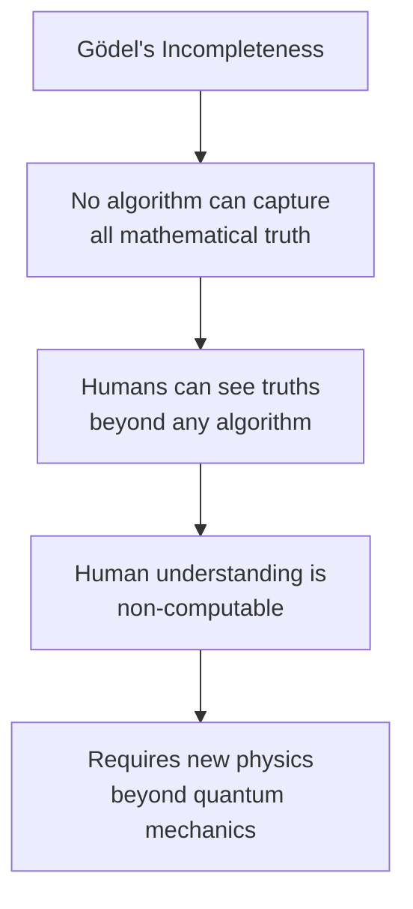
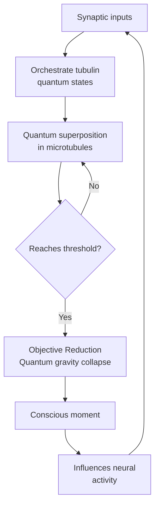
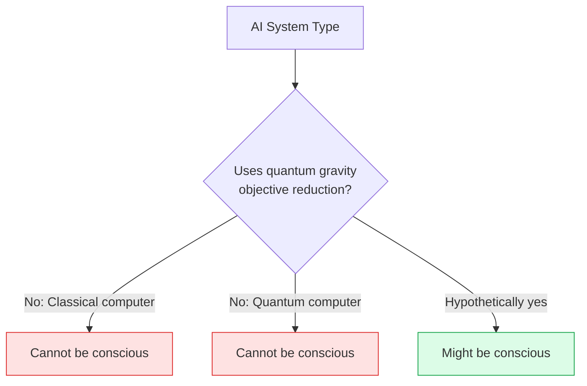

import { Card, CardGrid, Aside } from '@astrojs/starlight/components';
import Quiz from '@/components/Quiz';

## The Core Idea

[Orchestrated Objective Reduction (Orch OR)](https://doi.org/10.1016/j.plrev.2013.08.002), developed by physicist **Roger Penrose** and anesthesiologist **Stuart Hameroff**, proposes that consciousness arises from **quantum computations** occurring in structures called **microtubules** inside neurons.

The theory combines two radical claims:
1. Consciousness requires processes that cannot be computed by classical computers (Penrose)
2. Quantum coherence in microtubules provides the non-computable physics needed (Hameroff)

<Aside type="caution" title="Controversial Territory">
Orch OR is one of the most controversial theories of consciousness. Many neuroscientists and physicists are skeptical, but the theory has notable supporters and continues to generate research.
</Aside>

## Penrose's Argument: Why Consciousness Can't Be Computed

### The Gödelian Argument

Penrose argues that human mathematical understanding transcends computation:

1. Gödel's theorems show limits to what formal systems can prove
2. Humans can see truths that any given formal system cannot prove
3. Therefore, human understanding involves something non-computable
4. This non-computable process must involve physics beyond current theory

<Aside type="note" title="Penrose's View">
Penrose doesn't claim current physics explains consciousness—he claims a *future* physics of quantum gravity will be needed. Orch OR is a proposal for what that physics might look like (Penrose, 1989, 1994).
</Aside>

## Hameroff's Contribution: Microtubules

### What Are Microtubules?

Microtubules are protein structures inside cells:
- Made of **tubulin** protein dimers
- Form the cell's skeleton (cytoskeleton)
- Involved in cell division, transport, and signaling
- Present in neurons in large quantities

### The Quantum Microtubule Hypothesis

Hameroff proposed that microtubules could support quantum computation:

| Property | Role in Orch OR |
|----------|-----------------|
| **Tubulin states** | Can exist in quantum superposition |
| **Coherence** | Quantum states are "orchestrated" across tubulins |
| **Collapse** | "Objective reduction" of superposition creates conscious moments |
| **Anesthesia connection** | Anesthetics work by disrupting microtubule quantum states |

<CardGrid>
  <Card title="Quantum Superposition" icon="puzzle">
    Tubulin proteins in microtubules exist in multiple states simultaneously—quantum superposition extends across many tubulins.
  </Card>
  <Card title="Orchestration" icon="seti:broadcast">
    Quantum states are "orchestrated" by biological processes (synaptic inputs, gap junctions) to create coherent computations.
  </Card>
  <Card title="Objective Reduction" icon="star">
    When superposition reaches a threshold, quantum gravity causes "objective reduction"—collapse into a definite state. This is a conscious moment.
  </Card>
  <Card title="Non-computability" icon="seti:lock">
    The collapse is governed by Penrose's proposed physics, which is non-computable—thus consciousness transcends algorithms.
  </Card>
</CardGrid>

## The Mechanism in Detail

### Timing and Frequency

Orch OR makes specific predictions about the timing of conscious moments:
- Each OR event is a discrete "moment" of consciousness
- Frequency: ~40 Hz (gamma waves) corresponds to ~25ms between events
- More tubulins in superposition = richer consciousness

The formula relating consciousness to quantum gravity:

$$E \cdot T = \hbar / 2$$

Where:
- $E$ = gravitational self-energy of the superposition
- $T$ = time until collapse (duration of superposition)
- $\hbar$ = reduced Planck constant

## Evidence and Support

### Anesthesia Studies

Hameroff notes that anesthetics:
- Selectively disrupt consciousness (not other brain functions)
- Bind to hydrophobic pockets in proteins including tubulin
- May work by disrupting quantum coherence in microtubules

(Hameroff & Penrose, 2014)

### Gamma Synchrony

The ~40 Hz gamma oscillations associated with consciousness could reflect the timing of OR events. Orch OR predicts this frequency based on the number of tubulins involved.

### Quantum Biology

Recent discoveries show quantum effects in biology:
- Photosynthesis uses quantum coherence
- Bird navigation may involve quantum entanglement
- Enzyme catalysis may use quantum tunneling

This makes quantum effects in neurons more plausible than previously thought (Engel et al., 2007).

## Criticisms

Orch OR faces substantial criticism from multiple fields:

<Card title="Quantum decoherence">
The brain is warm and wet—conditions that typically destroy quantum coherence in microseconds. [Critics argue](https://doi.org/10.1103/PhysRevE.61.4194) quantum states in microtubules would decohere far too quickly for Orch OR to work.
</Card>

<Card title="Penrose's Gödelian argument">
Most philosophers and logicians reject Penrose's argument that consciousness requires non-computable processes. The argument has been criticized on multiple technical grounds (Putnam, Chalmers, and others).
</Card>

<Card title="No evidence for microtubule quantum computation">
There's no direct evidence that microtubules perform quantum computations. The proposal remains speculative.
</Card>

<Card title="Anesthesia alternatives">
Anesthetic mechanisms can be explained without invoking quantum effects. The correlation with microtubule binding doesn't prove quantum involvement.
</Card>

<Card title="Extraordinary claims">
Orch OR requires both new physics (objective reduction) AND new biology (quantum microtubule computation). Each is speculative; combined, the theory is seen as highly improbable by many.
</Card>

### Response to Decoherence Criticism

Hameroff and colleagues have responded that:
- Microtubules may have mechanisms to protect coherence
- Quantum effects in photosynthesis suggest biological quantum coherence is possible
- Recent experiments suggest longer coherence times than Tegmark calculated

(Hameroff & Penrose, 2014; Craddock et al., 2017)

## Implications for AI

Orch OR has **strongly negative implications for AI consciousness**:

### Why Classical AI Cannot Be Conscious

If Orch OR is correct:
1. Consciousness requires non-computable processes
2. Classical computers can only compute
3. Therefore, classical computers cannot be conscious—*regardless of software*

<CardGrid>
  <Card title="Classical Computers" icon="warning">
    Can never be conscious under Orch OR, no matter how sophisticated. They're fundamentally limited to computation.
  </Card>
  <Card title="Quantum Computers" icon="puzzle">
    Still insufficient—they compute (just differently). Need objective reduction, not quantum computation.
  </Card>
  <Card title="Microtubule-Based AI?" icon="rocket">
    Hypothetically, artificial systems using quantum gravity effects *might* be conscious—but we don't know how to build them.
  </Card>
</CardGrid>

<Aside type="tip" title="The Hard Barrier">
Under Orch OR, the barrier to AI consciousness isn't software or architecture—it's physics. No amount of better programming can bridge the gap if consciousness requires non-computable quantum gravity effects.
</Aside>

## Status in the Field

| Assessment | Detail |
|------------|--------|
| **Mainstream view** | Highly skeptical; most neuroscientists don't take Orch OR seriously |
| **Penrose's stature** | Penrose is a respected physicist (Nobel Prize 2020), which keeps the theory in discussion |
| **Ongoing research** | Hameroff's group continues experiments; some findings are suggestive but not definitive |
| **Falsifiable?** | In principle yes—specific predictions about timing, anesthesia, and quantum effects |

## Relationship to Other Theories

| Theory | Relationship to Orch OR |
|--------|-------------------------|
| **IIT** | Orthogonal: IIT is about information integration; Orch OR is about quantum physics |
| **GWT** | Could coexist: Orch OR might explain the *implementation* of global workspace |
| **HOT** | Orthogonal: Different levels of explanation |
| **PP** | Could coexist: Predictive processing might orchestrate the quantum computations |
| **Functionalism** | Strongly opposed: Orch OR is explicitly anti-functionalist |

## Test Your Understanding

<Quiz
  client:load
  title="Orch OR Quiz"
  questions={[
    {
      question: "Penrose's Gödelian argument for non-computability claims that:",
      options: [
        "Computers will eventually surpass human mathematical ability",
        "Humans can understand truths that no algorithm can prove, suggesting understanding involves non-computable processes",
        "Gödel proved that consciousness requires quantum mechanics",
        "Mathematical truth is ultimately unknowable"
      ],
      correctIndex: 1,
      explanation: "Penrose argues that humans can 'see' the truth of Gödel sentences that any given formal system cannot prove. If human understanding transcends what algorithms can do, it must involve physics beyond classical computation. Most logicians and philosophers reject this argument, but it's the foundation of Penrose's view."
    },
    {
      question: "A standard quantum computer STILL wouldn't produce consciousness according to Orch OR because:",
      options: [
        "Quantum computers are too slow",
        "Quantum computers perform quantum computation, but Orch OR requires objective reduction (non-computable quantum gravity collapse)",
        "Quantum computers don't have microtubules",
        "Quantum computers use qubits instead of neurons"
      ],
      correctIndex: 1,
      explanation: "Orch OR requires a specific type of physics: objective reduction via quantum gravity. Standard quantum computers do quantum computation (which is still computation, just with quantum parallelism). They don't involve the proposed non-computable collapse mechanism. Being quantum isn't enough; it needs to be the right KIND of quantum process."
    },
    {
      question: "Max Tegmark's decoherence criticism argues that quantum states in microtubules would collapse in:",
      options: [
        "Millions of years—far too slow for consciousness",
        "About 10^-13 seconds—far too fast for the proposed mechanism to work",
        "Exactly 25 milliseconds—perfectly matching gamma wave timing",
        "Never—microtubules are perfectly isolated"
      ],
      correctIndex: 1,
      explanation: "Tegmark calculated that quantum coherence in the warm, wet brain would decohere in about 10^-13 seconds—trillions of times faster than the ~25ms timescale Orch OR requires for conscious moments. This is the core physics-based criticism. Hameroff and Penrose dispute these calculations, citing biological mechanisms that might protect coherence."
    },
    {
      question: "Orch OR is unique among consciousness theories in that it predicts AI consciousness is impossible because:",
      options: [
        "AI lacks the right kind of information integration",
        "AI can't implement global broadcast",
        "No digital or quantum computer can implement the non-computable physics consciousness requires",
        "AI lacks higher-order representations"
      ],
      correctIndex: 2,
      explanation: "While other theories (IIT, GWT, HOT, PP) leave open the possibility of AI consciousness with the right architecture, Orch OR says consciousness requires non-computable physics that no computer—classical or quantum—can implement. The barrier isn't software or architecture; it's fundamental physics. This makes Orch OR uniquely pessimistic about machine consciousness."
    }
  ]}
/>

## Next Steps

Orch OR represents a radical, physics-based approach to consciousness. For a comprehensive comparison of how all theories evaluate AI consciousness potential, see the [Theory Comparison](/comparisons/01-theory-comparison/) page.
